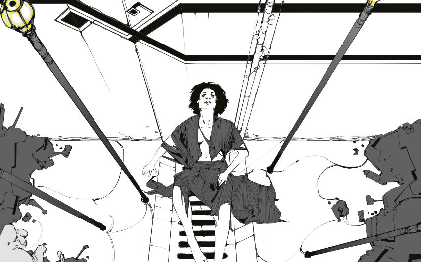
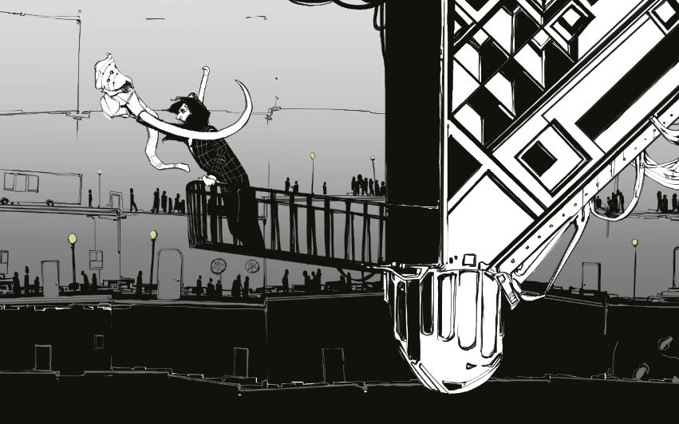
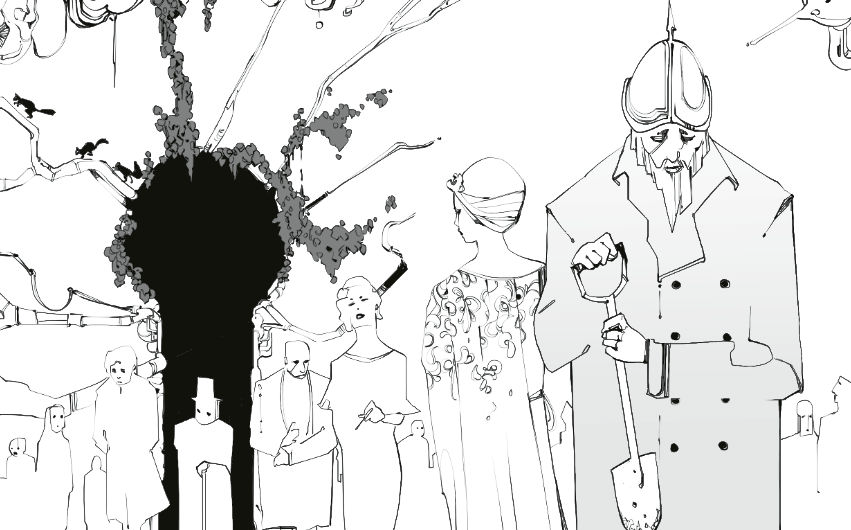

# 失败事业 Failed Careers

你在失败事业里得到的那些代表着你的过去。你可能一直依赖着它，直到它从你生命中消失，或是将其彻底抛在脑后。

关于某项能力或装备，如果你想了解更多，那么就跟大家进行讨论，然后最终让引导者拍板。

**范例名字**只是可选的，而你的外表可以与范例插画里的截然不同。

最年轻的玩家参考其失败事业中的债主。队伍则会共同欠下那个人或者机构 £10000。

对引导者来说，这一部分也是你的灵感源泉。不要在创建完角色后就把它抛开。

堡垒之地由其人民与故事所定义，而接下来会有数以百计的例子供你参考。用这些人来激发你的灵感，不论是角色、地点、流言还是事件。把他们的物品拿过来用作奇物与装备。拿走他们的名字与故事，为你所用。

那些插画中的每一个背景里的角色都可能成为你的下一个配角。每一个遥远的地点都可能成为你的下一个场景。

堡垒之地的精神流淌在这一章的每一页之中，好好利用它。

## 1. 贫民窟里的守护者 Gutter Minder

你是金字塔的底层
也是堡垒的坚壳

**范例名字**：霍普金，科克，德罗，约贡

若你是最年轻的玩家
团队欠下了£10K的债务，债主是……

**相关的掘墓人**：你们死后又被复活了。虽然你们功能齐全，但却散发着一股化学气味。

|你有|
| :-: |
|带钩的棍子（d6，笨重），破布|

||你身上发生了什么？|
| :-: | :-: |
|**£1**|**你坚信你自己是某种救世主**：你不是。|
|**£2**|**在实验中获得了人类身体的老鼠**：你依然可以和老鼠们交流，并大概理解其他啮齿动物的话。|
|**£3**|**你暗地里有个富裕家庭**：这种生活方式是你吸引他们注意力的手段。|
|**£4**|**你作为流浪儿活了下来并长大了**：所以你了解贫民窟里的其他人。|
|**£5**|**曾是上流社会的一员**：暴民起义中的唯一幸存者。|
|**£6**|**名声扫地的奇物教授**：因有争议的理论而被开除。|

||你在破布之下隐藏了什么？|
| :-: | :-: |
|1HP|**许愿剂**：三份烈酒，每份都能实现一个愿望。愿望的持续时间与酒劲相同（d6回合）。|
|2HP|**脱水野兽**：三个类似动物玩偶的橡胶制品，如果被扔进水里，就会膨胀为一只*阴湿恶兽*（15HP，d10践踏）。当这种生物一旦被杀死或者没有可以杀的东西时，就会碎成无生命的粉末。|
|3HP|**狂暴腺体**：当你*属性损失*或遭受严重痛苦时，你会飞速变得狂暴。你的下次近战攻击伤害+d10，但无法发动远程攻击。一旦攻击结束你就会恢复正常。|
|4HP|**平行世界转化器**：一个足以装下手枪的金属罐头。当物品被放入其中时摇晃罐头，它就会转化另一个现实中的平行版本。掷D6。1-2：只剩灰烬。3-4：变化主要在外观上。5-6：新版本比旧版本要好。每个物品只能被转化一次。|
|5HP|**屠夫烙印**：你手上的三个点型印记。当你杀死一个有价值的对手时，其中一点会随之变黑。在三个点都变黑后的一小时内，你的手臂会长出不自然的、强壮的几丁质利爪（d10伤害）。当你手臂恢复时，烙印重置。|
|6HP|**笼中啮咬兽**：一只被关在笼中的、虫猴结合的生物（6HP，d6啮咬）。会和指定目标战斗到你死我活，但会无视其他命令。如果赢了，它在溜回笼子前会吃掉对手的一部分。如果输了，它会变得很难过。|

## 2. 异物汇编者 Curiosity Compiler

你花了一辈子埋首于满是灰尘的东西和书本
现在是时候为自己而走出去了

**范例名字**：库普，霍克，特莱比克，萨尔瓦蒂翁

若你是最年轻的玩家
团队欠下了£10K的债务，债主是……

**战利品办公室**：在你们还清债务之前，都要顶着一个战利品悬赏金，这意味这别人偷你的东西也不算违法。

|你有|
| :-: |
|老旧的手枪（d6，在掷出6时会断掉），放大镜，花呢外套|

| |你了解关于什么的一切事情？|
| :-: | :-: |
|**£1**|**武器**：获得一本价格手册。|
|**£2**|**珠宝**：获得一幅单片眼镜。|
|**£3**|**艺术品**：获得一幅除尘刷。|
|**£4**|**甜品**：失去一颗牙。|
|**£5**|**桌游**：获得一些少见的骰子。|
|**£6**|**花卉**：获得一团丝带。|

| | 你最珍惜的奇物是什么？|
|-|-|
|**1HP**|**制械机**：鞋盒大小的沉重机器。有个可以塞入纸质说明的插孔，还有一个可以用于支付£10的硬币插孔。在叮叮当当一个小时之后，它就会制造出一个大致符合要求的物品，前提是大小合适。但任何精致的东西都会被做得很粗糙。|
|**2HP**|**掠夺爪**：一个抓钩，能牢牢地抓住活体组织。你知道解开它的技巧。|
|**3HP**|**恶魔项圈**：任何戴上项圈的人都会获得一幅骇人的外表，并且每天都会失去d6魅力。当魅力为0时，他会失去自己的个性，并将为你服务作为自己的新个性，但它只会遵循那些伤害他人的指令。|
|**4HP**|**粉末袋**：任何存入其中的粉末都会变得无穷无尽。将袋子内侧翻出来就能清空其中的东西，且不会有异常效果。目前容纳的是盐。|
|**5HP**|**圣所神像**：在其面前燃烧的蜡烛会化作烟雾扩散开来，强化周围所以的门、开放式的通道、通入房间的窗户。只要蜡烛还在燃烧就没有东西能够从这些地方进入。在室外不会产生效果。|
|**6HP**|**猛犸象面具**：具有极高的装饰价值，象鼻和象牙可以顶出去当武器（d6）用。|

## 03. 战壕征召兵 Trench Conscript

你从壕沟战里活了下来，但你的家信中没什么可写的
除了那条奇怪隧道里的东西

**范例名字**：卡里亚纳，乔普斯，加利亚，朱尔斯。

若你是最年轻的玩家
团队欠下了£10K的债务，债主是……

**科普勒&克兰德风投**：每当你在很久一段时间之后归来时，你剩余的债务各有五成几率减半或是翻倍。

| 你有                                                         |
| :-: |
| 壕沟霰弹枪（d8，沉重，射程极短），铲子，一包口香糖（牛尾巴）。 |

| |你在小队中的职务是？                                      |
| -------|-------------------------------------------------- |
| **£1**|**工程师**：获得3个战壕雷（d8范围）和铁丝钳。      |
| **£2**|**侦察兵**：获得颜料和便携画布。                   |
| **£3**|**坦克兵**：获得铅背心与头盔（1护甲）。            |
| **£4**|**随军牧师**：获得一瓶军力牌松子酒和一个圣驴徽章。 |
| **£5**|**突击手**：获得一个火箭筒（d10，一发）。          |
| **£6**|**军官**：获得口哨和军装。                         |

|  |你在那条隧道里发现了什么？                                   |
| --------|--------------------------------------------------- |
| **1HP**|**精粹提取器**：从一个平静或自愿的生物体内提取意识。这个意识可以被注入到一具新鲜的尸体中。可以使用一次。 |
| **2HP**|**复制器**：一个鞋子大小的盒子。放一个东西进去，就会得到两份复制品。复制品比原物品劣质许多，而原品会被摧毁。 |
| **3HP**|**悬浮板**：一个大餐盘大小的板子，只要你把某段特定的旋律哼上差不多十秒，这个板子就会冻结在原地。另一段十秒长的旋律将其释放。这块板子可以支撑最多一个人的重量，并且可以通过一次力量豁免来让它强行脱离。 |
| **4HP**|**联结圆盔**：任何戴上这个头部装置的人会被闪烁的画面和急促的声音所轰炸。他们会与下一个看见的人建立情感上的依赖，并愿意为之付出生命，直到他们再次入睡。 |
| **5HP**|**相位鼹鼠**：这只小哺乳动物能够通过相位移动进入任何材料而不破坏之。它能够说话，但却极度害羞，在面对问题时，它只会回答一个词，然后便再次通过相位移动进入主人的体内。 |
| **6HP**|**作祟之蛋**：这个石制的蛋可以被当作一件粗糙的武器（d6）。被蛋杀死的最后一个生物会以飘渺嗓音的形式寄宿在蛋里，并且会尽力回答任何问题。它所掌握的知识不会超出生前拥有的那些，但任何人都能够听懂它的话。 |

## 4. 讨债人Debt Squeezer

一些人付你点小钱，让你在阴暗的巷子里吓人
如果有必要，你还能见点血，但没有额外的报酬

**范例名字**：胡珀，基斯，多里奇，庞蒂亚克。

若你是最年轻的玩家
团队欠下了£10K的债务，债主是……

**科斯米卡赌场**： 你们共同拥有一个定制轮盘。

| 你有                                                         |
| :-: |
| 锤子 (d6)，散弹枪 (d6，范围伤害，可隐藏)。 |

| | 一场可怕的工作结束后，你用什么放松？                                      |
| ------|-------------------------------------------------- |
| **£1**|**嚼东西**：获得一包口香糖（鼠尾草）。      |
| **£2**|**玩弹珠**：获得一袋竞赛弹珠。                   |
| **£3**|**唱歌**：你有一副好嗓子。            |
| **£4**|**模仿**：在与某人长谈过后，你可以很好地模仿他。 |
| **£5**|**写回忆录**：你有个笔名，在出版业也有些关系。          |
| **£6**|**驱除噩梦**：没有夜灯你无法入睡。                         |

| | 你从债务人那偷到的最好的东西是什么？                                   |
| - | :-: |
| **1HP**|**灵魂警报器**：从一个平静或自愿的生物体内提取意识。这个意识可以被注入到一具新鲜的尸体中。可以使用一次。 |
| **2HP**|**熊熊果冻**：一罐散发着动物麝香气息的果冻。能吓跑小型生物，但会吸引大型哺乳动物。 |
| **3HP**|**绿土**：一小盆土壤。任何栽入其中的植物都会在一小时内生长一个季节的程度。但在其他方面正常生长。 |
| **4HP**|**创伤蜡烛**：在这只蜡烛照耀下发生的伤害会变得更加痛苦、混乱、有害，造成的任何*力量损失*都会翻倍。 |
| **5HP**|**热护目镜**：开启后，合法主人正在寻找的失窃物品会发光。 |
| **6HP**|**银行猪**：一只带有投币口的粘土猪。投入1便士会使它发出嘤嘤声。投入£1的硬币会使它变成一只普通的猪，持续一小时。一张£100的纸币会使它变成一头凶恶的野猪（7HP，d6戳击），持续一小时。如果它在猪的形态下死亡，它将永远无法变回来。存放的硬币也会永远丢失。 |

## 5. 死后上岸者 Dead-Shoresman
你曾死去，但从彼方找到了回来的路
没有人相信你的言辞，而你曾认识的人都早已离去

**范例名**：Peker，Abbie，Serpina，Lars

若你是最年轻的玩家
团队欠下了£10K的债务，债主是……

**踉跄深渊的哈夫温国王**：你们身上都烙有作为这位深野之王财产的烙印。

|你有|
| :-: |
|燧发手枪（d8，极其古老，难以维修），断桨（d6），冰冷的血|

|  | 你还记得什么？|
| :-: | :-: |
|**£1**|**自己的姓氏**：这个姓在堡垒依然有着极大的影响力。||
|**£2**|**堡垒的街巷**：你知道这座城市里的每一条路怎么走。||
|**£3**|**活体群星**：你有50%的概率会说你遇到的每一种语言。||
|**£4**|**上流社会**：你曾经家境殷实，因而受过良好的礼仪教育。||
|**£5**|**你曾是盲人**：你有能力完美的依赖回声定位。||
|**£6**|**只有梦魇**：你不需要睡眠。即使你想睡也无法做到。||

| | 你从死界带回了什么？|
| :-: | :-: |
|**1HP**|**失忆瓶**：任何浸入这水中的人都会失去将其浸入水中之人所指定的一段记忆。任何喝下这曾浸人的水的人将吸收这段记忆。只有在特定的水源才能重新灌满。|
|**2HP**|**二次机会骷髅**：当你死去时，你的肉体会分解为灰烬，随后立刻以完美的健康状态重新围绕着这颗头骨生长出来。|
|**3HP**|**备用头**：一个你可以随时换到脖子上的，和你的主头完全不同的脑袋。你的两颗脑袋都可以在没有身体的情况下毫无困难的生存，但都更喜欢作为主头而不是副头。这颗头不与你共享魅力，它的魅力需单独投。|
|**4HP**|**地狱椒**：一包高度浓缩的香料粉末。摄入一丁点都足以导致严重的胃痛和轻度幻觉，而把一整包全部吃掉则足以导致陷入足足一天的幻觉。|
|**5HP**|**鬼故事**：如果你在某人入睡前给他/她讲这个故事，他/她的全身骨骼就会以幽灵般的形态离开他们的身体一夜；这具无实体的骷髅在此期间可以完全按照他/她的意愿行动。这个故事对每个人只能使用一次。|
|**6HP**|**微型幻想**： 一团在空中盘旋、漂浮着，尺寸大概相当于一枚1便士硬币的色彩。它会遵守你的任何命令，并且在它触及的所有表面上留下一道多彩的痕迹。除此之外，它无法与任何东西进行任何物理交互。|

## 06. 官僚主义罪犯

堡垒的法律给每种罪行都设计了一个逻辑漏洞
人们付钱给你，以借你之手合法的犯下罪行

**范例名字**：Ranulph，Morrison，Carrock，Nika

如果你是最年轻的玩家

团队欠下了£10K的债务，债主是……

**守旧军团**：在找他们偿债时，他们愿意以原价的两倍买下任何现代科技产物，但是会立刻将其销毁。

-你有
一根撬棍（d6），一本法典。

|你有|
| :-: |
|一根撬棍（d6），一本法典。|

|| 你的特长是什么？|
| :-: | :-: |
|**£1**| 入室盗窃罪：获得3颗烟雾弹
|**£2**| 敲诈罪：每当你遇到一个权威人物时，你都有50%的概率知道他/她的一个秘密
|**£3**| 诽谤罪：你在媒体界有些熟人，他们会将你的任何谎言付诸铅字
|**£4**| 威胁恐吓罪：获得一把口袋手枪（d6，隐蔽）
|**£5**| 纵火罪：获得三颗燃烧弹（在扑灭前每回合造成d6伤害）
|**£6**| 谋杀罪：获得毒药和一支步枪（d8，笨重）

|| 你的上个客户没给钱，作为补偿他给了你什么？|
| :-: | :-: |
|**1HP**| 空白合约 - 一份仅具格式的空白合约，其具体内容任你填写；首先违反合约的一方会立刻被从天而降的闪电击中（d12，无视护甲），同时合约也会炸得粉碎。
|**2HP**| 真实之叶 - 把这份致幻草药卷成烟抽可以让你得知一个荒诞至极的事实和一个荒诞至极的谎言。只能使用一次。
|**3HP**| 乐于助人虫 - 一只金属的甲虫模型，可以完成简单的任务。
|**4HP**| 戏法硬币 – 表面上它只是一分钱，但是只有你知道怎样使用它的几个隐藏功能：首先，它是个微弱的光源；其次，它是一颗强力磁铁；最后，它还是一颗炸弹（d10，爆炸，使用后硬币毁灭）
|**5HP**| 回音投射器 - 可以收录最长10秒的声音，然后在收到指令时以远大于原声的音量将其重新播放出来。
|**6HP**| 人造人口香糖 - 咀嚼此糖会使其与咀嚼者产生一种链接，并开始变形为一个小型的，口香糖材质的咀嚼者。这一小型分身会遵守本体的命令，但态度极不情愿；给人造人的身体添加更多口香糖可以增大它的体型，但会降低它的忠诚程度。如果有另一个人吃掉并咀嚼了人造人，那么链接将会转移到新的咀嚼者身上。

## 07. 受证刽子手 Sanctioned Executioner
你在行刑队的时光已经结束
现在你被允许做些散工了

**范例名字**：赫尔穆特，迪娜，埃里希，达利亚。

若你是最年轻的玩家
团队欠下了£10K的债务，债主是……

**心智集成**： 你们的精神相互连接。若你们尽力集中注意力，每分钟都能向集成投射一个词。

| 你有                                                         |
| :-: |
| 步枪（D8，笨重），杀人许可证（一天一人，不可转让）。 |

| | 你是怎么保持自我的？                                      |
| :-: | :-: |
| **£1**|**社交**：获得一瓶杜松子酒。      |
| **£2**|**诗歌**：获得一本焦虑散文集。                   |
| **£3**|**回忆**：获得一条吊坠，里面装着一个你所爱之人的照片，他被带离了你身边。            |
| **£4**|**麻木**：获得一颗人工心脏，替代自己的心脏。 |
| **£5**|**音乐**：获得一个受苦痛的小提琴。          |
| **£6**|**慈善**：慈善组织认为你是一位慷慨的捐赠者。                         |

| | 你的良好服务赢得了什么奖励？                                   |
| :-: | :-: |
| **1HP**|**智能武器**：你的步枪也拥有智能，能够与持有者心灵交流。它的功能和普通武器一样，还可以提供聪明的建议。每日一次，它乐意进行的攻击获得+d10，但他不乐意进行的伤害会获得*削弱*。掷1d6来决定它的个性。1：荣誉。2：野心。3：嗜血。4：好奇。5：和平。6：寡淡。 |
| **2HP**|**轨道透镜**：任何穿过（并破坏）这个透镜发射的投射物都会快到不可能的程度，造成d12范围伤害并会撕裂身体组织。 |
| **3HP**|**星之信标**：一个轮胎大小的金属信标（要两个人才能携带），十分沉重，有一个配套徽章。按下徽章可以使佩戴者传送到信标处 |
| **4HP**|**时光药剂**：使你在十秒内与现实断开连接。你可以如常行动，但药效过后时间会回溯到你饮药之前，期间你做的所有事情都会被消除。一次性，即使回溯时间也是如此。 |
| **5HP**|**棍眼**：放在棍子上的玻璃眼球。持有者可以用它来观察事物。 |
| **6HP**|**威胁杖**：没有功能，但会发光和震动，以此暗示它能造成剧烈的痛苦。 |
## 08. 二流调查员 Fringe Investigator
从无足轻重的犯罪，到宇宙群星的奥秘

一切谜团都得被解开

**范例名字**：布兰奇，里奥，马扎林，波

若你是最年轻的玩家
团队欠下了£10K的债务，债主是……

**白杏缆车**： 你理论上被禁止使用任何类型的公共交通工具。

| 你有                                                         |
| :-: |
| 折叠枪（d6，可隐藏，在紧急时刻需要一次敏捷豁免来打开），一包口香糖（蜗牛）。 |

| | 你沉沦在什么之中？（这么做会回复你的魅力）                |
| :-: | :-: |
| **£1**|**水果派**： 选个最喜欢的。                         |
| **£2**|**逮住罪犯**： 尤其是那些犯下轻罪的。               |
| **£3**|**善举**： 帮助老人购物之类的。                     |
| **£4**|**拷问**： 不论嫌疑人是否有罪。                     |
| **£5**|**育雏**： 最好是在夜晚的屋顶上（需要卧巢一小时）。 |
| **£6**|**写日记**： 把你的所有私密念头写在一本日记里。     |

| | 你外套下是什么？                                             |
| :-: | :-: |
| **1HP**|**缸中脑**： 一罐盐水和电线，可以让一个刚死生物的大脑维持活性，并使其能够投射出自己的思想。大脑必须进食血液，否则就会死亡。 |
| **2HP**|**重塑丝帕**： 一块手帕，可以在覆盖任何物体一小时后修复它。该物体必须小到能够被手帕盖住。 |
| **3HP**|**多功能球**： 任何能合理地存在于多功能军刀中的工具都有50%的机会存在于该球体中。记下它有哪些工具，没有哪些工具。 |
| **4HP**|**饥饿钳**： 一个可以夹在松弛皮肤上的小夹子，会使受害者产生无休止的饥饿感，他们会不惜一切代价来满足这种饥饿感。他们不会因为过度进食而受到任何影响，但也不会比正常人更快饿死。 |
| **5HP**|**信息素包**： 吸引、愤怒和恐惧信息素各一剂，对任何智力接近动物的生物都有效。 |
| **6HP**|**小兄弟**： 一个能弹出2英尺高的自动人型装置（2HP, 护甲2）的罐子。它吵闹烦人，而且没法把你给的活干好。它也没有真正的战斗手段。在更换新的专用电池之前，它能够续航一小时。 |

## 09. 贬谪贵族 Disinherited Socialite
不管你和你的家族之间发生了什么，你现在都没有遗嘱中的继承权了。你带走了能拿的东西。

**范例名字**：彻尔，埃米尔，安诺，布朗维尔。

若你是最年轻的玩家
团队欠下了£10K的债务，债主是……

**特雷芬运河挖掘公司**：你得带着一个监护你的烦人恶仆，他跟着你，把相关信息报告给你的债主。如果恶仆没了，你的债务增加£1K。

| 你有                 |
| :-: | 
| 阔剑（d8，Bulky），3瓶高档葡萄酒，褶边衬衫 |

| | 你还在合法遗产中获得了什么？                 |
| :-: | :-: |
| **£1**|**忠诚管家**：没有别处可去。（3HP） |
| **£2**|**猎犬**：过了壮年。（4HP，d6 bite）         |
| **£3**|**猎鹰**：你母亲的最爱。（2HP，d4 claws）         |
| **£4**|**华贵衣物**：塞满了一行李箱。         |
| **£5**|**决斗手枪**：你的一位兄弟姐妹有对应的另一把。（d8）   |
| **£6**|**粗制盔甲**：祖传板甲。（Armour，1，Bulky）   |

| | 你从宝库里偷偷带走了什么？                 |
| :-: | :-: |
| **1HP**|**势不可挡杖**：扔出去的时候，什么都不能能阻挡这根手杖的运动，包括重力。不论它运动轨迹如何，它最终会飞向太空。 |
| **2HP**|**诅咒玩偶**：影响玩偶的东西也会影响你，无论这影响是有利的还是有害的。        |
| **3HP**|**血浆转换器**：吸取一具尸体中的血液，制造出一个药丸。吃下药丸后，你能使用一次该尸体生前的某一个特性。        |
| **4HP**|**相伴球**：一个空心球，总是在你身后滚动着、跟随着你。它可以绽开，其中有脑袋大小的空间，能够储存物品。它会完美保护好空间里的东西。         |
| **5HP**|**地上天使**：一个小泥塑。把它砸烂会造成地震。附近的人会因此摔到地面上，附近的建筑受d12伤害。一次使用次数。 |
| **6HP**|**宇宙中正官**：一根灰色手杖，你可以让它评判两个物品的优劣。必须高声说出评判标准，接着手杖就会拉来标准中更优的物品。|

## 10. 除害人 Verminator
堡垒的角落里藏着各种各样的动物
一旦它们显得多余了，你的工作就开始了

**范例名字**：乔克，马莱尔，瑞格，埃迪。

若你是最年轻的玩家
团队欠下了£10K的债务，债主是……

**玻璃板日光浴服务公司**：你们都接受了顶级服务，因此你们现在的皮肤状态都特好。

| 你有                 |
| :-: | 
| 毒气枪（d6范围伤害, 笨重，只对会呼吸的生物有效），防毒面罩（防护空气中的有毒物质）|

| |你有什么特制装备？                 |
| :-: | :-: |
| **£1**|**折叠梯**：能装进你的口袋里。 |
| **£2**|**伸缩捕兽钩**：上面加装了一堆附件。|
| **£3**|**一包捕鼠夹**：在人道或致命中做选择。|
| **£4**|**潜望镜**：伸缩与旋转。|
| **£5**|**防护服**：只能防住小的害兽。|
| **£6**|**多功能鸟鸣器**：能够吸引或驱逐。|

|  |哪种动物你杀不了？（现在它们陪伴着你）                 |
| :-: | :-: |
| **1HP**|**吞食者**： 足球大小的虫子，窝在你背包里。每天可以被食物叫醒一次，吃下与它等体型的有机物，无论有多难以下咽，对它而言都一样。|
| **2HP**|**蛆虫王子**：有金色标带的小蛆。苍蝇和蛆虫会为其让出空间，同时，任何会吃虫子的东西都会非常想吃掉它。|
| **3HP**|**噩梦飞蛾**：除了你，任何和飞蛾处于同一屋的人都会作噩梦。当他们醒来时，飞蛾以噩梦中的某种东西的形式出现。|
| **4HP**|**惨白蚁**：一只大白蚁，被封在盒子里。一旦被释放出来，它会立刻钻入它能找到的最近的生物体内，造成剧烈疼痛。一分钟内，受害者长出坚硬的盔甲（护甲1）且能吐酸（d6持续伤害）。这会持续一小时，直到受害者吐出d6条惨白蚁并恢复正常为止。|
| **5HP**|**蛇猫**：一个布偶，蛇身猫头。如果你遇到一条有敌意的蛇，它就会变成一只猫（4HP，d6爪击）。如果你遇到一只有敌意的猫，它就会变成一条蛇（4HP, d6啮咬, 被其重伤时承受d6力量损失）|
| **6HP**|**平和的大狗**：你唯一能忍受的动物。(6HP, d6啮咬，只在报复时攻击)|

## 11. 迷失的探险家
你曾踏上寻宝之路
如今则是唯一的幸存者

**范例名字**：乌果，巴卡拉，莉莉哈特，巴斯。

若你是最年轻的玩家
团队欠下了£10K的债务，债主是……

**大象补偿屋**：被归还的任何象牙货物能偿还等同于其原有价值两倍的债务。

| 你有                 |
| :-: | 
一对手枪（每把d6）

|  |你在队伍里的职责是什么？
| :-: | :-: |
| **£1**|**归档员**：获得望远镜与一套书写工具|
| **£2**|**咨询师**：获得一套芳香调理套装|
| **£3**|**训鹰师**：获得一只受训的猫头鹰（5HP,D4)|
| **£4**|**冶金学者**：获得一枚炸弹（d10范围）|
| **£5**|**屠夫**：获得一把切肉刀（d6）|
| **£6**|**酱料师**：获得一套小煮锅|

|   |你从探险中带回来了什么？|
| :-: | :-: |
| **1HP**|**保存起来的灵魂**：一个枯萎的人型生物。扔进火里之后便会释放出一个疯狂的外星人幻影（d8眼中射线，非物质，在肆虐1d6轮之后便会消失在一道光里）。
| **2HP**|**打捞珍珠**：在扔进水里后，这颗闪耀的珍珠会沉入水底，附在它触碰到的第一件东西上。在发出指令后，它会浮上水面，将附着的东西一并带上来。
| **3HP**|**凶暴藤壶**：一个凶猛的软体动物（1HP，护甲1），会小声地发出嘲讽，并在死去时像一枚炸弹一样爆炸（d12范围）。
| **4HP**|**藤果**：如果被吃下去，会有藤蔓从嘴中涌出（1d6力量损失），然后疯长并攀附到任何可能的表面上。能用一次。
| **5HP**|**仙果种子**：一袋黄金种子，如果扔出去，没有动物能抵御它的诱惑。
| **6HP**|**鸽子骨架**：组装得很小心。被砸碎后会释放出一群迷茫的鸽子。

## 12. 高墙之子 Wall-Born
堡垒的一圈圈高墙拔地而起，直至它的中心，不论那究竟是哪

你既是墙的守卫，也是它的居民

**范例名字**：寇贝尔，狗腿，诺金，普林斯

若你是最年轻的玩家
团队欠下了£10K的债务，债主是……

**增强部**：你们每个人都可以选择拥有一个人造耳朵、鼻子、舌头或眼睛。它们有一个控制装置，可以降低对应部位的灵敏度，但无法被调到高于正常人的水平。

| 你有                                   |
| :-: | 
| 警棍（d6），钩爪，一包口香糖（铁锈味） |

|  | 你在墙上干什么？                                             |
| :-: | :-: |
| **£1**|**灌浆工**：获得一把刷子和一桶灌浆。                  |
| **£2**|**渠壁清理工**：获得一根清洁刮杆（d6）。              |
| **£3**|**驱鸟人**：获得一把假手枪（只能发射空包弹）。        |
| **£4**|**高等民兵卫队**：获得一顶花哨的帽子。                |
| **£5**|**守夜人**：获得一盏射灯。                            |
| **£6**|**民兵中士**：获得一顶带羽毛的花哨帽子，大嗓门和令你蒙羞的记录。 |

|  | 你在那块松动的砖后面发现了什么？                             |
| :-: | :-: |
| **1HP**|**野兽模式配方**：一种液体补剂，可使饮用者在一分钟内获得特定动物的特性。例如：鹰之眼、犬之鼻、熊之力。总共有三剂。 |
| **2HP**|**孤儿之殇**：6盎司的乳白色饮料。1盎司可安抚任何不安，2盎司可引起深度睡眠，3盎司则会带来永眠。 |
| **3HP**|**主干石**：一块鹅卵石，可以将自身转化为它最后接触的任何非生物材料。目前其材料是你口袋里的皮革。 |
| **4HP**|**瘟疫疣**：一个精心提取，被密封在罐子里的疣子。任何接触到它的人都会感染一种恶心的瘟疫。每小时损失d6 STR。受害者的触摸会立即传播瘟疫。你并不知道任何治疗方法。 |
| **5HP**|**肉干灵**：一块肉干的雕像。无论什么人吃了这个，在接下来的一个小时里都会表现得像个十足的混蛋，甚至对他们最爱的人也是如此。 |
| **6HP**|**万能针**：一根可以插入任何材料表面的发簪。如果插进肉里，并不会引起疼痛。 |

## 13. 专业赌徒 Professional Gambler
你知晓如何玩好游戏
还知晓如何更好地作弊

**范例名字**：布什卡，贝格，维尔戈，雷蒙。

若你是最年轻的玩家
团队欠下了£10K的债务，债主是……

**棍与珠受证掠夺者**： 你可以索要堡垒中任何建筑的蓝图，但它很可能是过时的。

| 你有                                                         |
| :-: |
| 气枪（d6，射程极短），一包口香糖（雪松味）。 |

|  | 你拿手的赌法是什么？                                      |
| :-: | :-: |
| **£1**|**街边台球**：获得一根球杆（d6）和一件背心。      |
| **£2**|**单卡诈唬**：获得一个装满小镜子的口袋，这些镜子可以粘在任何平面上。                   |
| **£3**|**贫民窟骰子**：获得两对骰子：一对可被操控，一对普普通通。            |
| **£4**|**康克戏**：获得一根竞技用康克绳，而且你知道最好的树都在哪里。 |
| **£5**|**扔鞋**：你可以把类似鞋子的东西扔得又远又准。          |
| **£6**|**鸟镖**：获得一套飞镖（d4，对小型飞行物+d8伤害）。                         |

|  | 你赢得了什么？（另一个人对此依旧很不开心）                                   |
| :-: | :-: |
| **1HP**|**主宰单片眼镜**：可以用念力移动任何物品，但大于一枚硬币的重量需要通过魅力检定，否则单片眼镜破碎。 |
| **2HP**|**自我镜**：一面袖珍镜子，可以反映出最冒犯观看者本人的一面。 |
| **3HP**|**反物质钥匙**：插入钥匙孔中便会彻底抹除门和它自身。 |
| **4HP**|**微型护盾发生器**：老鼠大小的项圈，能在小小的佩戴者周围形成一层力场（护甲3）。 |
| **5HP**|**伽马管**：破碎则会发射出绿色光束，使目标获得d6力量。目标的体型会增长50%，物理攻击获得+d10。如果力量超过了18，那他只能在怒火中行动。任何效果都会在战斗结束后消失。一次性。 |
| **6HP**|**恐怖盐**：能把任何生物从睡眠或昏迷中唤醒，但会使其在恐惧中挣扎和尖叫几秒钟。随后他便会失去这段记忆。 |

## 14. 融入的外星人 Integrated Alien
你在很久以前就来到了堡垒，几乎被视作人类。
在一颗远方的恒星下，从地下或海洋中而来。

**范例名字**：艾瓦克斯，厄瑞林，格雷斯，克劳布。

若你是最年轻的玩家

团队欠下了£10K的债务，债主是……

**排队办公室**：当你回去还债时，需要花上d4×d4小时来排队。每过4个小时，要再加上d4小时。饮水车全程可供使用。

|你有：|
| :-: |
怪奇枪，钢绳，模糊的口音。

|  | 你的怪奇枪是什么？|
| :-: | :-: |
**£1**|发射**尖叫磁碟**（d8，响声巨大，笨重）。
**£2**|发射**蛆虫弹**（d8，只对有机组织有效，笨重）。
**£3**|发射蛋形**爆炸丸**（d6范围伤害，笨重）
**£4**|发射**紫色光线**（d6，无视护甲，笨重）
**£5**|发射**振动波**（d8，无痛，死亡时爆炸，笨重）
**£6**|发射**黑刺**（d10，刺必须回收后才能再次发射，笨重）

那快被你忘记的故乡是什么？
**HP1**|**陷落**：深海都市。你天生有鳃且能在黑暗中视物。
**HP2**|**寄生**：奴隶蜂巢。你能感知到附近的昆虫。你恨它们。
**HP3**|**达-拉格**：水晶群山。像蜘蛛一样爬上未加工的自然石面。
**HP4**|**焚烧**：燃烧之穴。火焰无法伤害你。
**HP5**|**溃烂**：瘟疫要塞。用一个触碰就能吸走他人身上的疾病，但你自己会染上这种疾病的削弱版。
**HP6**|**星云**：天空之光。随心所欲地发出各色光芒。

## 15. 下层捕鲸人 Underwhaler
最大的鱼获位于水底或地底的深处
只需一次捕捞就能让船长暴富，但你只能分得一些小钱

**范例名字**：斯克林肖，多克，朗古斯，古斯。

若你是最年轻的玩家
团队欠下了£10K的债务，债主是……

**道格和韦尔拍卖行**： 你的衣服比你想得要华丽一些，但全都染着一点死亡的气息。

| 你有                                                         |
| :-: |
| 射矛枪（d8，笨重，矛必须回收），一包口香糖（座头鲸味）。 |

| | 你如何应对黑暗？                                      |
| :-: | :-: |
| **£1**|**多吃萝卜**：你可以在黑暗中视物。      |
| **£2**|**不应对**：获得一盏耀眼但易爆的灯。                   |
| **£3**|**音乐**：你能吹出出色的口哨，安抚人心。            |
| **£4**|**很多烟**：获得一包香烟。 |
| **£5**|**很多酒**：获得一瓶海员琴酒。          |
| **£6**|**做好万全准备**：获得一个鲸鱼炸弹（d8范围伤害，在水下+d12伤害）。                         |

|  |你设法搞到了什么下层捕鲸人的产品？                                   |
| :-: | :-: |
| **1HP**|**恶臭熏香**：一罐带着灯芯的蜡。点燃时，罐子顶上会慢慢滴下污水。放上一个小时它就会燃烧殆尽，但产生的污水足以填满一个大房间。 |
| **2HP**|**活体精油**：涂到某物品上时，会使它在接下的一个小时内获得生命，担任你忠实的仆从。仅一剂。 |
| **3HP**|**排洗糖浆**：除去饮用者身上所有的有害效应，除了死亡任何效应都可以消除。但它还会在各种意义上洗刷一边身体。仅一剂。 |
| **4HP**|**创世糖蜜**：一罐深绿色的糖浆，无论被洒在哪里，都能使得茂密的植被在几分钟内生长出来。如果被吃了，那受害者将失去d6力量并咳出苔藓。一次性。 |
| **5HP**|**茧蜡**：任何被这种蜡覆盖住的东西都会被封在一个茧里，24小时候就会破茧而出，和之前相比会长出翅膀、充满敌意。一次性。 |
| **6HP**|**剧痛肌腱**：触碰到裸露的皮肤时会引发剧痛（你有手套）。伸展开来时有10米之长，直接作为武器使用时并不是很有效（d6）。 |

## 16. 流浪艺人 Travelling Show-Person
障眼法和小花招是你的拿手好戏
即使观众开始流失，你还藏有最后一招

**范例名字**：凯斯，奥利凡塔，阿奇，维克特。

若你是最年轻的玩家
团队欠下了£10K的债务，债主是……

**高危工人工会**： 每有一人带着明显的伤口回归，你们的债务便减少£500。

|你有|
| :-: |
|隐藏的小刀（d6），舞台服装。|

| | 你的表演是什么？                                      |
| :-: | :-: |
| **£1**|**花式射击**：获得一把长手枪（d6）。      |
| **£2**|**投掷飞刀**：获得飞刀（d6）。                   |
| **£3**|**扭曲身体**：你全身都是双关节。            |
| **£4**|**恶心的肉体恐怖**：你感觉不到痛。 |
| **£5**|**催眠术**：获得一枚怀表。 这都是骗人的，你总是请托儿。         |
| **£6**|**吞咽与反刍**：只要是能吞进去的东西，你都能随意地吃下去再吐出来。你仍受人类肠胃的身体限制。                         |

| |你的绝技是什么？                                   |
| :-: | :-: |
| **1HP**|**空间折叠**：在两个你看得到的平面上制造一道门。若你穿过这道门或移开视线，它就会关闭。 |
| **2HP**|**蜘蛛皮肤**：你能像只蜘蛛一般爬在物体表面。 |
| **3HP**|**热射线**：作为常规武器来说没用，但可以集中在一个固定的目标上，逐渐提升其热量。一回合可以使其变得温暖，两回合可以使其燃烧/融化，三回合可以使其化为灰烬。 |
| **4HP**|**镜像引擎**：制造你的完美复制品。它能像你一样独立行动，但不能与任何东西进行物理互动。直到被消除或是新的复制品被创造出来为止，它会持续存在。 |
| **5HP**|**骨头磁铁**：吸引或排斥一个有骨骼的目标，除非其通过一次力量豁免。对软骨没有效果。 |
| **6HP**|**加仑注射器**：一个小小的注射器，可以抽取多到足以用来洗澡的液体。。 |

## 17. 帮内执行者 Gang Enforcer
内部威胁会害得帮派四分五裂
执行者负责保证一切井然有序

**范例名字**：尤里克、甘内特、巴普、索。

若你是最年轻的玩家
团队欠下了£10K的债务，债主是……

**专业个人美容院**：今天你们所有人都打扮得非常精致华丽，但到了明天，就会变得看上去非常疲惫，除非你回去再次预约（每人£100）。

|你有|
| :-: |
|一张破脸。|

| | 被你抛弃的帮派是什么？                                      |
| :-: | :-: |
| **£1**|**垃圾场要务**：获得一把狗步枪（d6）和护目镜。      |
| **£2**|**坚固之国**：获得一把大锤（d6，笨重）和银色面漆。                   |
| **£3**|**苦难角斗士**：获得一把三叉戟（d6）和可笑的头饰。            |
| **£4**|**都市之雅**：获得一把细剑（d6）和带夸张蕾丝的衣服。 |
| **£5**|**肉之蜂巢**：获得一把巨剑（d8，笨重）和大量穿孔。         |
| **£6**|**蜗牛组**：获得一把手枪（d6）和一罐油脂。                      |

| | 你用什么让目标感到恐惧？                                   |
| :-: | :-: |
| **1HP**|**心灵感知**：目标必须通过偶一次魅力豁免，否则你会发现他们内心最深处的秘密。 |
| **2HP**|**地狱装置**：让你能看见的明火发生爆炸（d8范围伤害，之后火焰每轮造成d6伤害）。 |
| **3HP**|**卵形炸弹**：爆炸为一团米色的粉尘，在爆炸范围附近形成一颗两米高的蛋。任何处于其中的东西都无法突破它，但从外面下手却能轻易破坏。这颗蛋会让其中的东西开心地生活下去，直到被释放。一次性。 |
| **4HP**|**食人鱼炸弹**：产生一群饥饿的食人鱼（10hp，d6噬咬）。当没有食物时，它们会互相噬咬。显然，离开水之后就无效了。 |
| **5HP**|**代理锁链**：当多个事物被这条锁链连接时，对他们之中任何一个的伤害都会影响到他们所有人。 |
| **6HP**|**放逐棍**：可以用作寻常的武器（d6），但若它刺入一颗活着的心脏（重伤），目标会不会受伤，而会被送入地底。如果他们回到了你的身边，也肯定会有所改变。 |

## 18. 拆除者 Deconstructor
新事物若要兴起，旧事物必须崩塌
我们也不是不能享受这过程

**范例名字**：多米，科基，维尼，斯米夫。

若你是最年轻的玩家
团队欠下了£10K的债务，债主是……

**红道救济基金**： 你共同获得一个生存包裹，里面有星之水、月之晶，还有一些圣之土。它们全部没用。

| 你有                                                         |
| :-: |
| 大锤（d6, 笨重），喷灯。 |

| | 你抢救到的东西里，最好的是？                                      |
| :-: | :-: |
| **£1**|**摔门炸弹**：在一个大房间大小*范围*内，使得所有的门和窗户猛然打开或关上，即使它是防盗的。一次性。      |
| **£2**|**破坏碟**：一个金属制的碟子，能塞进最严密的机器里，使其以最严重的方式发生故障。                   |
| **£3**|**时间炸弹**：在*范围*周围的10米内形成一个球体，其中的时间减慢到六十分之一。仅持续球体外时间的1分钟，或者说仅持续球体内时间的1秒。一次性。            |
| **£4**|**火汽笛风琴**：一个酷似喇叭的角，可以从中火喷出火焰。 |
| **£5**|**次级信号枪**：可以向天空发射燃烧信号弹的单发信号枪，信号弹能烧穿任何挡路的物质，留下一个拳头宽的洞。          |
| **£6**|**杀人蜥蜴**：一只黑红相间的蜥蜴（5hp，护甲，d6带毒啮咬，造成重伤时使目标麻痹），梗犬大小。如果让它尝到任何有机组织的味道，它就会准确无误地找到并杀死组织的来源，随后在附近寻找一个新主人。                         |

| | 你的同事为什么嘲笑你？                                   |
| :-: | :-: |
| **1HP**|你**烦人的弟弟或妹妹**不管在哪都跟着你（2d6属性，1HP，d6锤子）。 |
| **2HP**|你那**邋遢的狗**（4HP，d6啮咬）闻起来很臭。 |
| **3HP**|你非常爱护你的**宠物鼹鼠**（1HP）。 |
| **4HP**|你**对金属过敏**（导致让人难受的皮疹）。获得一组手套。 |
| **5HP**|你背地里是一位**天才舞者**。 |
| **6HP**|你的**糟糕衣品**。获得一件搭配淡紫色衬衫的芥末色外套。 |

## 19A. 街头法官 Street Judge
堡垒有着如此多的法庭，以至于整座城市就是个有效的司法场所
你靠着可疑的证书处理街头纠纷

**范例名字**：弗林奇，托德，博盖伊，福莱尔

若你是最年轻的玩家
团队欠下了£10K的债务，债主是……

**斯勒伦斯·廷根-拉尼**：对自己足够好奇的物品会出价d10×£100，并会拒绝哪怕只有一点点的讨价还价。如果你们不卖给他，他就会派出打手来找你们。

|你有|
| :-: |
|战斗用木槌（d6，笨重），法典（不完整）|

| | 你为什么不再从事这行了？|
| :-: | :-: |
|**£1**|**狂吃蘑菇**：获得一袋迷幻菇。|
|**£2**|**臭名昭著的醉汉**：获得一瓶苦艾酒。|
|**£3**|**背负责任**：有个法官欠你一个人情。|
|**£4**|**对法律感到幻灭**：烧掉你的法典，获得一把雷击枪（d6范围伤害，短距）。|
|**£5**|**被暗中卸职**：因为你让监狱太快地满员了。获得法官仪式甲（护甲1，笨重）。|
|**£6**|**被逮到受贿**：其他法官厌恶你，部分人的原因只是因为你被逮到了。|

| | 你总是带着什么？|
| :-: | :-: |
|**1HP**|一只用于象征的**鹰**，但具有攻击性。|
|**2HP**|**忠诚的抄书吏**（1HP，力量5，敏捷7，魅力7，老人，除了抄书啥都不会）。|
|**3HP**|带套索和头套的**弹出式绞刑架**。|
|**4HP**|**烟雾弹**与作秀的意识。|
|**5HP**|带握爪的**假肢**。|
|**6HP**|**坏名声**。任何站在法律对立面的人都认识并厌恶你。|

## 19B. 训鸦人 Rook Tamer
*作者：Emmy Allen创作*

围绕堡垒的鸦群见证了一切
幸运的是，它们似乎很喜欢你

**范例名字**：艾丽，沃伦，詹斯，艾琳

若你是最年轻的玩家
团队欠下了£10K的债务，债主是……

**市政塔工人**：你欠堡垒尖塔、屋顶的维护工一笔罚款。它们要求用石板与瓷砖赔偿。

|你有|
| :-: |
|带钉的长杆（d6，笨重），3只宠物乌鸦（1HP，d4啄击，在周围飞翔）|

| | 乌鸦向你展示了什么样的影像？|
| :-: | :-: |
|**£1**|**天空的影像**：获得一对滑翔翼。它可以让你从屋顶跳下并安全落地。|
|**£2**|**死亡的影像**：获得一瓶甲醛。|
|**£3**|**暗中犯罪的影像**：获得一根末端带钩的绳子。|
|**£4**|**废墟的影像**：获得一根撬棍。|
|**£5**|**烟雾的影像**：获得护脸围巾。|
|**£6**|**疾病的影像**：获得一根用于戳爆你身上各种疖子的长针。|

| | 乌鸦为什么信任你？|
| :-: | :-: |
|**1HP**|**你听得懂它们的话**：获得一本用于翻译它们叫声的鸟类字典。|
|**2HP**|**你曾治愈过其中一只乌鸦**：获得一瓶乙醚和一组针线。|
|**3HP**|**你给它们带来亮晶晶的东西**：获得一条华丽的金项链。|
|**4HP**|**你生活在它们之中**：获得一打华丽的观赏性羽毛。|
|**5HP**|**你给它们带来腐肉**：获得一只装在纸袋里的人手。|
|**6HP**|**你与它们相似**：你的头被酷似鸟爪的笨拙假肢替代。|

## 20A. 流浪儿群 Urchin Pack
待在一起是你们唯一活下去的希望

特殊：你们可能不止一个人

**范例名字**：鲁道夫，西芮，埃德蒙，马瑟

若你是最年轻的玩家
团队欠下了£10K的债务，债主是……

**梦露甜粥**：你们都对糖分上瘾。如果一天都没有吃特别甜的东西，你就会陷入窘困。

|你有|
| :-: |
|小刀，石头|

| |什么让你们聚在一起？|
| :-: | :-: |
|**1HP**|共同拥有一只**儿童火枪**（d6，笨重）。|
|**2HP**|你们是**兄弟姐妹**。|
|**3HP**|仅存的**孤儿院爆炸幸存者**。|
|**4HP**|一种**心灵链接**。|
|**5HP**|你们都会说**流浪儿语**，一种只有流浪儿才能听懂的语言。|
|**6HP**|字面意义上的**连在一起**。|

| |你们有多少人？|
| :-: | :-: |
|**1HP**|只有一个**幸存者**，但你有些野。你可以像狗一样挖过松软的土，并且像狼一样嗅到恐惧的味道。|
|**2HP**|**两个**，每人有1HP。获得一件长外套。当你站在对方的肩膀上时，看起来会像是一个成年人。|
|**3HP**|**三个**，每人有1HP。其中两个拒绝跟对方说话。|
|**4HP**|你们有**四个**，每人有1HP，其中一个是条狗。|
|**5HP**|你们有**五个**，每人有1HP，而且病得很重。自动败于所有力量豁免，直到仅有一个流浪儿活着。|
|**6HP**|你们这群有**六个**，但太过依赖彼此，所以你们行动时视为一人。如果你让其中一个单独行动，那么他算作拥有1HP，在所有属性上均为3。|

## 20B. 迷糊的调酒师 Muddled Mixologist
*作者：Mary Hamilton*

一杯太多

千杯太少

**范例名字**：墨菲，托钵僧，斯文伯恩，里奥

若你是最年轻的玩家
团队欠下了£10K的债务，债主是……

**红魔酿酒厂**：你理论上被禁止进入它们旗下数量众多的每一间酒馆、酒吧或者别的饮酒场所，你违规喝下的每一杯酒都会记在你的债务上。

|你有|
| :-: |
|一瓶美酒，一瓶劣酒，一个完美的领结|

| | 你的酒吧有什么特色？|
| :-: | :-: |
|**£1**|**把戏**：获得一个强化的投掷玻璃和一个橡胶练习瓶。你知道如何扔东西；如果真的被逼急了，你可能会玩杂耍。|
|**£2**|**分子调酒学**：获得一套小注射器和专用的发泡器。你懂足够的基本化学知识来让几乎任何液体变成胶状。|
|**£3**|**经典**：获得一个铜制的调酒器和一个结实的搅拌器（d4）。如果被追问，你可以用令人惊讶的方式讲述这个城市的酒吧历史。|
|**£4**|**提基像**：获得一整个菠萝和一套陶制杯子，你可以把几乎所有水果做成花哨的动物装饰品。|
|**£5**|**难找**：获得一个由皮革包裹着的装着各种自制苦味剂和灌木的小瓶子。只要有足够的时间，你可以腌制、保存或浸泡几乎任何东西。|
|**£6**|**高度违法**：获得一小批用纸包着的几乎算是食品安全级的粉末。如果你别无选择的话，你可以通过拉人情来获得毒品——只是有趣的那种，不是难搞的那种。|

| | 你瓶子里装着什么酒？（拿上这瓶）|
| :-: | :-: |
|**1HP**|**导航**：黑朗姆酒、青柠、橙子酒、可可苦酒。喝酒的人无论喝得多醉，都能找到回家的路。|
|**2HP**|**游荡者**：威士忌、红苦艾酒、阿玛罗、苦味剂。液体的优雅。|
|**3HP**|**黄金蟒**：肉桂利口酒，金叶，新鲜薄荷，苹果汁，苦艾酒。引起强烈幻觉。|
|**4HP**|**红火球**：甜茴香利口酒与野草莓月光酒。高度易燃（d6）。|
|**5HP**|**亡者复苏 No. 23**：柠檬、甜酒、杜松子酒。字面意义上让人起死回生。能用一次。|
|**6HP**|**普瑞巴林**：烟熏味，甜味和柠檬味。只是一种非常、非常好的饮料。绝对不是神经毒剂。|

## 21.群星赐福者 Star Blessed
你不止崇拜活体群星
还从它们之一那里得到了赐福

**范例名字**：普露思，维嘉，雷吉拉，哈麦尔。

若你是最年轻的玩家
团队欠下了£10K的债务，债主是……

**巴兹顿金库守卫教团**：你们共同拥有一颗金库破坏炸弹（d12，必须安装在固定位置后引爆）

| 你有                 |
| :-: | 
| 狼牙棒（d6），仪式头带 |

| | 你在星佑者联盟（Star-Blessed Union）中的职位是？                 |
| :-: | :-: |
| **£1**|**传道士**：获得一本星之书（Star Book）。 |
| **£2**|**敲钟人**：你爬绳子的速度特别快。|
| **£3**|**献祭人**：将你的狼牙棒替换为献祭用锤（d8）。|
| **£4**|**观察者**：获得一支望远镜和一瓶鸡汤。|
| **£5**|**自我鞭笞者**：获得鞭子（d6）和满身的鞭痕。|
| **£6**|**厨子**：获得剁肉刀（d6）和大规模餐饮从业许可证。|

| | 星辰赐予你的礼物是？               |
| :-: | :-: |
| **1HP**|**破碎的蛇鸡兽纹章**： 两块上面刻有眼形纹章的铅块。任何同时拿着这两块铅块并看向它们的人都会失去d20点魅力|
| **2HP**|**狂野之舌**：你能和任何生物对话，但它们告诉你的内容很可能没有道理可言。|
| **3HP**|**高尚的肿瘤**：这个长在你身上的、肉眼可见的肿包会把下一个进入你身体的有害效应——不论是毒素、诅咒、寄生虫还是其他——吸收掉，然后脱落化为尘土。|
| **4HP**|**外星骨**：看上去和许愿骨（火鸡的Y形胸骨，传说两人分别握住Y的两支然后拉动并许愿的话，骨头断掉时拿着较大的一半的人的愿望将会实现——译者注）一模一样，但它一旦断裂就会对半径10米内的所有生物爆发出一股痛苦的精神波动（失去d20点魅力）。|
| **5HP**|**气囊**：你的胸口长有一个可以主动充气的肉质气囊，充满气时其直径可以达到2米。你的肺部可以直接呼吸气囊里的空气，但是请记得充了气的气囊是会浮在水面上的。|
| **6HP**|**碟形灼痕**：在人工光源照射下会抽搐；此时你可以主动让自己缓缓飘向那个光源。|

## 23. 去革命者 Un-Revolutionary
每天都有新的革命，新的街垒
人潮流过，总得有人在后面收拾东西

**范例名字**：加夫，阿波罗，乔伊，卡夫瓦克

若你是最年轻的玩家
团队欠下了£10K的债务，债主是……

**薄薪协会**：你只能用零钱还债。

| 你有                                                 |
| :-: |
| 五角星帽，扫帚 |

| | 你从老家带了什么过来？            |
| :-: | :-: |
| **£1**|一瓶亮黄色的**花蜜酒**，只有一点酒精浓度，可以当成中等强度的胶水用。             |
| **£2**|一罐**鼻烟尘**，可以吸上三次。能让你打上一次强劲的喷嚏，排出体内的任何有害物质。  |
| **£3**|一只娇贵的**宠物兔**（2HP）              |
| **£4**|一包**口香糖**（烟味），配有一个搞笑的分配器。 |
| **£5**|一只**亮绿色的鹦鹉**，会说些反革命的短句。                 |
| **£6**|一个**美味无比的三明治**，放在一个坚固到离谱的午餐盒里。           |

| | 你用什么破坏街垒？  |
| :-: | :-: |
| **1HP**|**火焰喷射器**：d6，笨重，范围伤害。 |
| **2HP**|**破坏性步枪**：d6，对建筑或大型敌人时+d10，笨重。 |
| **3HP**|5颗**接近地雷**：d8范围伤害，掷出1时无法爆炸。 |
| **4HP**|3颗**毒气弹**：d6范围伤害并产生烟云。每轮都持续对处于其中的人造成伤害。 |
| **5HP**|3颗**尖刺炸弹**：d8范围伤害。引信很短，只在刺入某物后才会被激活。 |
| **6HP**|3颗**安全燃烧弹**：在熄灭之前每轮造成d6伤害。对活体组织无效。 |

## 23. 人类联盟成员 Human Unionist
这世上充满了古怪又强大的事物
但它们都不值得我们崇拜

**范例名字**：杰里吉扎，克洛维克，伊诺古斯，坦格塔

若你是最年轻的玩家
团队欠下了£10K的债务，债主是……

**超噬菌体宿主**： 你学会了安全吃下任何东西的技巧，只要它不比你的拳头大，但只有食物能提供营养。

| 你有                                                 |
| :-: |
| 高帽和腰带 |

| | 你的日间工作是什么？            |
| :-: | :-: |
| **£1**|**屠夫**：获得一把菜刀（d6）。             |
| **£2**|**教师**：获得一把手杖（d6）。   |
| **£3**|**面包师**：获得一把面包刀（d6）。               |
| **£4**|**私人调查员**：获得一把手枪（d6）。 |
| **£5**|**河蛇猎人**：获得一张弓（d6）。                 |
| **£6**|**攀岩者**：获得攀岩靴和一把镐子（d6）。           |

| | 什么让你加入了联盟会  |
| :-: | :-: |
| **1HP**|你从**宇宙绑架案**中生存了下来。当异界生物说出另一种语言时，你因它们说的话会感到刺痛。 |
| **2HP**|你只是**热爱人类**，并想要保持它的纯净。获得火焰弹（在熄灭之前每轮造成d6伤害）。 |
| **3HP**|你被拒绝加入**死祝会**。获得一个偷来的死蛇标记。 |
| **4HP**|你的**父母**是高级成员。你在统一会中有一定的影响力。 |
| **5HP**|大部分是为了**找乐子**。获得一桶啤酒。 |
| **6HP**|你的家在一次**不明的爆炸**中被摧毁。获得烧伤的皮肤。 |

## 24. 自由工程师 Liberal Engineer
我们要坐在现代性的矛尖上
那就总有流血的风险

**范例名字**：费朗斯，皮埃罗，拉苏斯，乔伯特

若你是最年轻的玩家
团队欠下了£10K的债务，债主是……

**锡兵团**： 如果你愿意，你们中第一个死去的人能够以活体金属的形态复生（护甲2，但速度要比原来慢得多）。

| 你有                                                 |
| :-: |
| 鸭脚排发枪（d6，范围，射程极短），一袋滚珠轴承和螺栓 |

| | 你为今天准备了什么？            |
| :-: | :-: |
| **£1**|一辆**自行车**。             |
| **£2**| 一把结实的**雨伞**（d6）。   |
| **£3**| 一壶**鹅汤**。               |
| **£4**| 一条**长围巾和暖和的帽子**。 |
| **£5**| **罐装派**。                 |
| **£6**| 一罐**防兽喷雾**。           |

| | 你最近的项目是什么？（你走了狗屎运，现在没法造出另一个了）   |
| :-: | :-: |
| **1HP**|**仆从器**：一个能把佩戴者变成无脑机械的铜头环。受影响者会服从其收到的任何命令。 |
| **2HP**|**典当漏斗**：一根又大又旧的金漏斗，可以被插进地里。往里面扔任何东西，便会有一块等同该物品市值一半的石头或宝石弹出来。如果将这块石头或者宝石归还到漏斗里，那么原本的物品则会被弹出来。 |
| **3HP**|**空雷**：一袋漂浮的爆炸性气体（d10，范围），一旦激活后就会变得非常敏感，有1/6的几率被提前引爆。 |
| **4HP**|**摇杆炸弹**：转动摇杆来给炸弹蓄能，每摇一轮，投一颗d6，在你把炸弹炸弹扔出去时就额外造成这么多伤害。当总伤害超过12时，炸弹在你脸上炸开。 |
| **5HP**|**冲击爪**：造成1d10点伤害，如果你投出10，那么你对自己造成伤害。 |
| **6HP**|**原初黏胶**：抹在身上会让皮肤变得柔软接近胶质。你可以像是没有骨骼与内脏般扭曲和挤压自己的身体。但只有进入水中时你才能获得休息的好处。如果你离开水一整天，该效果就会结束。 |

## 25. 假面惊惧者 Masked Horrorist
恐怖的事物自地底而来
我们必须与恐惧为友，把它们吓回去

**范例名字**：波塔，隆比娜，沃特，松尼

若你是最年轻的玩家
团队欠下了£10K的债务，债主是……

**人们**：你记不住这个协会里任何人的长相或名字，也记不住他们是做什么的。但需要的时候，你总能找到其中一员。

| 你有                                                 |
| :-: |
| 手炮（d6，响声巨大），惊惧假面 |

| | 你的面具是？            |
| :-: | :-: |
| **£1**|**饥械**：你可以吃下金属，用以替代食物。             |
| **£2**|**红兽**：你的嗅觉和听觉比狗还强。   |
| **£3**|**角娃**：当你提出要求时，拒绝的人会感到剧烈（但无害）的痛苦。               |
| **£4**|**铁蛇**：当彻底吃下一个生物，你就会了解到它曾见过的一切。 |
| **£5**|**虚面**：你引发不出任何声音，也不会留下任何脚印。    |
| **£6**|**灰人**：一切生物都能理解你的话语，但它们没有服从你的义务。           |

| |当你摘下面具时？   |
| :-: | :-: |
| **1HP**|你每次摘下面具，都可以选择你的脸长什么样。 |
| **2HP**|动物会不喜欢你的脸。 |
| **3HP**|面具和你用手术连在了一起，再也无法被摘下。 |
| **4HP**|你必须戴眼镜才能正常视物，用面具也行。 |
| **5HP**|不戴面具时，你无法说话。 |
| **6HP**|你那面具之下已被毁容了。 |

## 26. 罗洛克俱乐部毕业生 Rollocker Club Alumni
美好时光，公平竞争
学校精神！

**范例名字**：威兰，吉戴尔，费弗，罗克德

若你是最年轻的玩家
团队欠下了£10K的债务，债主是……

**时间执行者第二团**： 你们拥有同步表。

| 你有                                                 |
| :-: |
| 运动球棒（d6，笨重），俱乐部夹克 |

| |当你还是学生时本该学什么？            |
| :-: | :-: |
| **£1**| 获得一套没读过的**科学**教科书。             |
| **£2**| 获得一套没读过的**美术**教科书。   |
| **£3**| 获得一套没读过的**历史**教科书。               |
| **£4**| 获得一套没读过的**工程学**教科书。 |
| **£5**| 获得一套没读过的**医学**教科书。                 |
| **£6**| 获得一套没读过的**政治**教科书。           |

| | 你真正花时间做的是什么？   |
| :-: | :-: |
| **1HP**|**摔倒**：你可以不受任何伤害地跌落20英尺。 |
| **2HP**|**恶搞敌对俱乐部**：获得一个烟雾弹、一个臭味弹和一个火焰弹（在熄灭之前每轮造成d6伤害）。 |
| **3HP**|**混合饮料**：你知道每一种鸡尾酒的配方，并获得一瓶工业朗姆酒。 |
| **4HP**|**你不记得了**：获得一只猪（4HP，d4啮咬），穿着俱乐部配色的衣服。 |
| **5HP**|**掠夺酒窖**：获得一瓶加度葡萄酒，你还能在黑暗中视物。 |
| **6HP**|**欺负新人**：获得一瓶乙醚。 |
## 27. 守旧的军团士兵 Backward Legionnaire
未来只有一片黑暗
守旧！永不求新！

**范例名字**：莫尼埃，西尔米，耶利米，布拉米亚

若你是最年轻的玩家
团队欠下了£10K的债务，债主是……

**苍蝇预言家**： 当你欠他们债务时，任何类型的群居昆虫都不会打扰你。

| 你有                                                 |
| :-: |
| 非现代的服装，火焰弹（在熄灭之前每轮造成d6伤害） |

| | 你坚持使用什么过时的武器？            |
| :-: | :-: |
| **£1**|一把山胡桃木制的长弓（d6）。             |
| **£2**| 三把标枪（d6），你给每把都取了名字。   |
| **£3**| 棍棒 （d6, 笨重）。               |
| **£4**| 钝化的镰刀（d6，笨重）。 |
| **£5**| 流星锤（d6）。                 |
| **£6**| 配有老旧石头的投石索（d4）。           |

| | 你拥有的最过时的东西是什么？   |
| :-: | :-: |
| **1HP**|一套**链甲**（护甲1，笨重）。 |
| **2HP**|价值£10的**石头硬币**深野里可能会有人接受它。 |
| **3HP**|一面**鲁特琴**。没人会制造合适的琴弦了。 |
| **4HP**|便携但沉重的**日晷**。 |
| **5HP**|带两个水桶的**担子**。 |
| **6HP**|一辆**战车**（没有东西拉它）。 |
## 28. 受约落荒者 Contract Castaway
为了一份可怜的报酬，你替代旗子占领了一块岩石
那沉闷的岁月已经过去，所以你回到了大陆。

**范例名字**：塔吉斯，格罗特，费尔诺，阿布曼

若你是最年轻的玩家
团队欠下了£10K的债务，债主是……

**圣躯之子**： 你们带有他们的印记（一个黑色沙漏）。  你们感受不到疼痛，但你们的伤口永远不会愈合。当债务得到偿还时，印记就会消失。

| 你有                                                 |
| :-: |
| 手杖（d6），网，一包香糖（鹦鹉味） |

| | 你长期服务的最终报酬是什么？            |
| :-: | :-: |
| **£1**| 一枚锡制**奖章**。             |
| **£2**|一根大**巧克力棒**。   |
| **£3**|终生的**狗粮供应**，前提是你不从中牟利。               |
| **£4**|你在你那小岛上的小**画像**。 |
| **£5**|一张**金票**，可以让你加入任何一场离开堡垒的远航或旅途。                 |
| **£6**|一套时髦的**鞋子**。           |

| | 你在岛上发现了什么？   |
| :-: | :-: |
| **1HP**|**水晶球**：它会尽可能有用地回答是或不是的问题，每天一次。它知晓一切。   |
| **2HP**|**一包肥胖豆**：吃了一个后你就再也不能跑动或者跳跃，直到你睡过一晚上。 |
| **3HP**|**黑气罐头**：打开它会使得房间陷入黑暗，直到出现新的光芒。一次性。           |
| **4HP**|**一罐不明血液**：若倒入一具尸体之中，它就会为你完成一项任务，随后便会吐出血液，彻底死亡。 |
| **5HP**|**星图**：显示出你无法从天中认出的星座。任何试图破坏这本书的人会被闪电击中（d12，无视护甲）         |
| **6HP**|**被缝坏了的娃娃**：吓到小孩和动物了。       |
## 29A. 被压制的心灵异能者 REPRESSED PSYCHIC
它就在你脑子里

你要控制不住了

**范例名字**：乌拉尔、马莱克、尤里斯、弗兰森

若你是最年轻的玩家
团队欠下了£10K的债务，债主是……

**地下眷族**：他们的办公室很远很远，而他们的变异非常非常地严重。

| 你有           |
| :-: | 
| 一些玻璃珠子。 |

| | 你是如何隐藏自己的能力的？                                   |
| :-: | :-: |
| **£1**|**在一座偏僻的矿场工作**： 获得一把镐子（d6，沉重）。  |
| **£2**|**你从未躲藏过**： 获得一把手枪（d6）。                |
| **£3**|**在一艘筏子上随波逐流**： 获得一把捕鱼矛（d6）。      |
| **£4**|**参加佣兵团**： 获得一把有问题的骑兵来复枪（d8，沉重，在投出1时永久破损）。 |
| **£5**|**一场灵魂朝圣之旅**： 获得一把匕首（d6）和日益增长的愤世嫉俗。 |
| **£6**|**蒙蔽自己的双眼**： 获得一根手杖（d6）。                    |

| | 你隐藏的能力是？                                             |
| :-: | :-: |
| **1HP**|**磁力**，用你手中的力量掌控未被抓紧的金属物品。     |
| **2HP**|随意**穿墙**或者穿门。但如果墙太厚，你就没完全进到里面去。 |
| **3HP**|你可以**把自己的意识转移**到一具新鲜试题中。每次你在新身体中经历紧张情况时，你必须通过一个魅力检定，否则便需要返回自己的身体。 |
| **4HP**|你可以**完美地预测**其他人抛出的硬币落地时的正反。   |
| **5HP**|当你的注意力集中在某人身上时，你对他们**隐形**。     |
| **6HP**|你可以通过触碰他人来**感受他们的动机**。             |
## 29B. 游方真菌学家  MENDICANT MYCOLOGIST
*概念来自埃蒙·穆赫兰*

你对真菌如此痴迷

对教派的戒律却漫不经心

**范例名字**：E.Q.冬园，A.R.克莱门特，M.R.H.韦克斯勒，F.F.托马森

若你是最年轻的玩家
团队欠下了£10K的债务，债主是……

**奥纳格·胡德，凄凉诗人**： 每人都获得一件黑色乐器，它们被专门调试过，只能演奏凄凉的爵士乐。

|你有|
| :-: |
|廓尔喀反曲刃 (d6)，标本箱，教派的传统帽子（下面有腮的菌伞）。|

| | 你为何离开了教派？|
| :-: | :-: |
|**£1**|**违反卫生规定**： 获得霉菌感染。|
|**£2**|**违背了独身誓言**： 你的配偶会陪伴你（3HP，时尚外套）。|
|**£3**|**你在臆想中看到了自己的命运**： 获得一袋迷幻蘑菇。|
|**£4**|**赢了彩票**： 然后在赞助一场不明智的探险后失去了一切。获得一张通向某个古怪地方的地图。|
|**£5**|**你患上了真菌过敏**： 获得一包一次性手套。接触真菌会让你身上出现烦人的皮疹，在你去见专家之前，你陷入窘困。|
|**£6**|**你开始悄悄地迷上青苔**： 获得一包藏起来的咸苔。它唱起来很美味，而且如果你把它放在包里，保持湿润，它就会再长出来。|

| | 你还带着什么珍稀物种？|
| :-: | :-: |
|**1HP**|**幽灵帽蘑菇**： 在刚死之人旁散发光芒。|
|**2HP**|**超蘑菇**： 存粹是理论产物，存在于四维空间。吃了就可以安全地解决一个悖论。|
|**3HP**|**孤独龙骑士**： 大而坚韧的菌伞，耐火。可以作为盾牌使用（+1护甲）。|
|**4HP**|**攻城羊肚菌**： 抗虫害，能在任何表面上生长，尝起来淡得离谱。|
|**5HP**|**噩梦毒菌**： 会导致长时间睡眠和可怕的噩梦。|
|**6HP**|**月亮海绵**： 浸泡在月光下。切开后会溢出吸收的光线。|

## 30A. 菜鸟截肢师 Amateur Amputator
没受过那些精细东西的训练

你只处理那些结构性的东西

**范例名字**：胡洛克，杰格，把手，丹特

若你是最年轻的玩家
团队欠下了£10K的债务，债主是……

**德比·灭世者**： 从理论上说，你欠她的是一笔你不记得自己点过头的邪教会员费。

| 你有             |
| :-: | 
| 骨锯（d6），乙醚 |

| | 什么让你的病人坐立不安？                                     |
| :-: | :-: |
| **£1**| 你**咆哮的切割机**：将你的骨锯替换为研磨锯（d8，沉重）。 |
| **£2**|**对麻醉剂的不信任 **： 将你的乙醚替换为一个治愈之手的徽记。 |
| **£3**|**现场糟糕的卫生**： 获得一只脏兮兮的白鼬（2HP，d4啃咬，非常臭）。 |
| **£4**|**你的幽默感**： 获得一本解剖笑话集。                  |
| **£5**|**你的偏执**： 带上一把你随时不离手的小手枪（d6）。    |
| **£6**|**你的视力**： 获得一副镜片非常厚的眼镜（没了它你眼前就一片模糊）。 |

| | 你上班时还带了啥？                                           |
| :-: | :-: |
| **1HP**|**万能缝合线**，可以将两个有机生物结合为一个存在，只能使用一次。 |
| **2HP**|一罐**笑气**。                                       |
| **3HP**|可调焦距的**放大镜**。                               |
| **4HP**|老旧不堪的**镊子**。                                 |
| **5HP**|可以替换你非常用手的**钩子**。                       |
| **6HP**|一瓶**强效香水**。                                   |
## 30B. 投资百夫长 INVESTMENT CENTURION
*概念来自马特·“投石机”·王*

你是一百名交易员的领袖

其中任何一个都可能出卖你

**范例名字**：马谢尔，努纳隆，费尔梅特，达维特

若你是最年轻的玩家
团队欠下了£10K的债务，债主是……

**人民印刷社**： 如果他们发现你购买了任何并非由他们所印刷的纸制品，他们会往你的债里加上£500。

| 你有                                     |
| :-: | 
| 带有装饰的拆信刀（d6），穿旧了的商业服装 |

| | 你设法从你的办公桌上取回了什么？                             |
| :-: | :-: |
| **£1**|**专注沙漏**： 翻转后能跑十五分钟，如果翻转沙漏的人在这段时间内偏离了当前的任务，他会失去d10点魅力，其大脑会被震得重新专注起来。如果他完成了任务，沙漏会自豪地响起来。 |
| **£2**|**每日一词日历**： 锁定在当前日期，所以你没法往后翻。上面的词总是一条线索，指向将在今天发生的事情。 |
| **£3**|**激励杯**： 在倒入热饮后会显示一条励志的名言和场景。在喝下饮料，思索名言后，你回复任何损失的魅力。 |
| **£4**|**诱惑方块**： 表面覆盖着按钮和开关，任何第一次看见它的人都会陷入窘困，直到他能玩上一会或者得到自己的方块。 |
| **£5**|**饮水鸟**： 一件金属玩具，可以慢慢喝下放在它面前的任何液体。在指定的温度下，根据指令分配液体。在指定的温度下将液体倒出。不能同时容纳两种以上的液体，但似乎有着无限的容量。 |
| **£6**|**压力锤**： 一把可以令人极度满足的锤子（d6），只要你用它打碎任何价值£1k以上的东西，或者伤害到任何人，你就可以回复任何损失的魅力。 |

| | 你是怎么记录这些数字的？                                     |
| :-: | :-: |
| **1HP**|**你（大多）凭运气**：获得一枚幸运币（75%的时候翻向对你有利的那一面）。 |
| **2HP**|**你外包了棘手的部分**： 你知道大部分方言，而且能够很好地模仿它们。 |
| **3HP**|**孪生子**： 获得两只成对的袖扣或戒指，你可以对着其中一只小声地询问一个与数字相关的问题，用另一只听取答案。 |
| **4HP**|**用脑子**： 你对数字的记忆力堪称完美。               |
| **5HP**|**现代手段**： 获得一个多功能电子计算器。在使用前需要大量清盘。 |
| **6HP**|**老牌方法**： 获得一把饱经风霜的算盘。               |
## 31b.极地赏金猎人 Polar Bounty Hunter
极地无尽的迷雾是最好的藏身之处
你尽力将迷失之人带回家，不论以哪种方式

**范例名字**：普德尔，维奇勒，沃夫汉德，比古尔。

若你是最年轻的玩家
团队欠下了£10K的债务，债主是……

**幻想师**：在他们的办公室里摆着一本巨大的无字书，封面上写着你们的名字。如果你们没能按时还款，他们能通过在书上添加内容的方式让你们经历很不好的事情。

| 你有                 |
| :-: | 
| 长杆斧（d8，笨重）|

| | 你有多强悍？                 |
| :-: | :-: |
| **£1**|获得一条会服从你任何命令的**狼**（5HP，d6，啮咬）。 |
| **£2**|获得一位爱慕你的**随从**（1HP，d6棍棒）。|
| **£3**|你的**口哨声**足以穿透任何噪声，传至远方。|
| **£4**|你**免疫**酒精和其他毒素。|
| **£5**|你有能力用双手和牙齿**强行打开**任何你能拿得动的容器。|
| **£6**|获得一只**眼罩**，以及一个关于你得到它的过程的引人入胜的故事。|

| | 迷雾赐予了你什么能力？                 |
| :-: | :-: |
| **1HP**|**雾语**： 和你进行视线交流的人能听到你低语的任何内容。|
| **2HP**|**雪血**：你不会受到极端低温的伤害。|
| **3HP**|**冰掌**：你可以通过用力拍手灭掉小型火焰。|
| **4HP**|**寒目**：你有着纯白色的双眼，对此人们并不喜欢。|
| **5HP**|**雾肺**：你总是能看到自己的呼吸。|
| **6HP**|**渴海**：你只能通过喝盐水生存，无法通过喝淡水解渴。|

## 31B.死者工程师Necro-Engineer
堡垒的所有产业之中属尸体的生产效率最高
如此之大的产量需要现代的解决方案

**范例名字**：都、金希、高格农、泽夫瑞内。

若你是最年轻的玩家
团队欠下了£10K的债务，债主是……

**欢乐引擎**：一座拥有自我意识的、建筑物大小的赌博机。每当你拜访它时都可以尝试旋转它的轮盘赌一次，若你赢，则债务减半，反之则债务翻倍。引擎的胜率是52%。

| 你有                 |
| :-: | 
| 阴森的正装，铲子 |

| | 你是怎么在尸体处理行业中找到工作的？                 |
| :-: | :-: |
| **£1**|**为不配合的尸体挖掘最深的墓穴**：用动力挖坟机（d8，笨重，噪声极大，能以快得让人害怕的速度挖穿土壤）替换你的铲子。 |
| **£2**|**专业扫墓人**：有一小拨堡垒内的花店终身为你免费提供花束。|
| **£3**|**让鸟儿噤声**：获得一支杀鸽枪（d6，笨重）。|
| **£4**|**寡妇安慰者**：获得一把折叠伞。|
| **£5**|**你是在一座坟墓里出生的**：你能隔着一间房间感受到对面尸体的存在。|
| **£6**|**赶走食腐者**：有一只勉强说得上是驯化过的鬣狗（5HP，d6啮咬）一直跟着你。|

| | 你那（一直找不到人投资的）大计划是什么？                 |
| :-: | :-: |
| **1HP**|**火化穹顶**：获得一件可以穿在你那套正装外的防火防护服。|
| **2HP**|**安息金字塔**：你看一眼就可以说出建筑的大致高度和年龄。|
| **3HP**|**盛宴花园**：获得一袋腐肉之种（乌鸦、秃鹫和其他食腐鸟类难以抗拒这些种子的诱惑）。|
| **4HP**|**蛋白质改造动议**：获得一罐风味掩盖膏（任何东西抹上这种膏后都会变得可口）。|
| **5HP**|**永恒游轮之旅**：获得一顶阴森的船长帽。|
| **6HP**|**群星葬礼**：你感觉群星都在嘲笑着你的失败。如果你一个人呆在群星之下的话，你会变得窘困。|

## 32A. 仿偶 Mockery

用毛毡、木头和绳子制作的模仿生命之物

你不需要吃、喝、睡眠，也不需要爱，但你仍然能感受到欲望

**范例名字**：特雷蒙， 小猪， 须藤， 德伦奇特

若你是最年轻的玩家

团队欠下了£10K的债务，债主是……

**不成对者**: 如果你们被发现携带任何成对的东西，他们会让你们的债务上涨£505。

你有

隐藏刀（d6），3枚模型炸弹（d8，小规模范围伤害）。

你是哪一种仿偶？

£1 仿制狐狸：你获得一件皮夹克。

£2 仿制獾：获得一条长围巾。

£3 仿制蜥蜴：获得一个单片眼镜。

£4 仿制袋鼠：获得一个烟斗。

£5 仿制金丝雀：获得一个矿工头盔。

£6 仿制猪：获得一顶礼帽。

你有什么戏剧性的天赋？

1HP 唱歌跳舞：获得一把乐器。

2HP 机械工作：获得一个工具包。

3HP 入室盗窃：获得一张面具和一个礼品袋。

4HP 官僚主义：获得一个可调节订书机。

5HP 烹饪：获得一卷锡纸。

6HP 嗅出谎言：能够严厉地凝视。

## 32B. 阿尔法测试员

由Eric Dalehite创作

为了保证安全性，你必须按下按钮、扳动开关、品尝胶水

世界上只有你的合同能比你的薪水更糟糕

**范例名字**：阿尔佛，巴塔，伽墨，德尔特

若你是最年轻的玩家

团队欠下了£10K的债务，债主是……

**母矿脉企业孵化基地**：一个会把所有决策委托给一个幼儿工作组的企业集团。共同拥有一个“探险生存工具包”，其中包含糖饼干、一把塑料螺丝刀、一只塑料长颈鹿，以及一瓶甜牛奶。

你有：

伸缩杆(d6)，防护服(护甲2，仅针对爆炸和火焰，笨重)。

发生在你身上的最糟糕的事是什么？

£1 在一场酸液喷发中失去了所有头发。

£2 乘坐电梯时失去了一条腿。获得一条低质量假肢。

£3 在放松舱内停留时间过长后，心脏停止跳动。获得一个机械心脏。

£4 因过于强力的玩具弩而失去了一只眼睛。

£5 因实验性的化妆品，皮肤变成了绿色。

£6 因机械安慰狗失去了一条手臂。获得一条低质量假肢。

你设法留下了哪个不安全的装置？

1HP 3个颠簸饮料罐——一种饮料和电荷的混合物，在饮用一罐后，你在24小时内不需要睡觉，在此期间内你不会被突袭，总是保持警觉。在24小时过去后，直到你睡满24小时前你会处于窘困。

2HP 灵体投影仪——投影并控制自己的幽灵形态，最远到10英尺远。幽灵形态是无实体的，可以穿过墙壁，但任何与火或者电的接触会对你的原本身体造成d12伤害。

3HP 超时空电话——只要你在几个街区之外，你就可以拨打任何寻常的电话。你可以选择向过去一小时前，或未来一小时后打电话。任何引起时间悖论的尝试都会断开通话并对你造成d12伤害，因为你相互冲突的时间线被强迫合并了。

4HP 机械安慰狗——1 HP，护甲3，d6啃咬。只能听懂它自己的名字、说话、坐下和杀人这几个命令。其他时候它只是笨拙地跟着你。

5HP 暴雪烟花——底部有一根绳子的塑料管。拉动绳子有两种效果，各有五成概率；需要12小时再填充。

雪暴：在欢乐的铃声后，无害的假雪从烟花壳中喷出。

尘暴：在不和谐的铃声后，恶臭的燃烧尘（d8，范围伤害）从烟花壳中喷出。

6HP 忍耐手环——说出一项自己的生理需求，例如“饥饿”或者“口渴”，然后把手环扣在手腕上。当你戴着手环时，你不再有这种生理需求，甚至不能自愿地满足它。当你摘下手环时，所有的饥饿或者口渴都会追上你，如果你不能立刻满足这些回溯的需求，你将会死亡。
## 33. 金牌饲养员 Prize Breeder
你曾有个兽舍，里面都是经过优良培育的动物
但现在你只剩下最后一对了

**范例名字**：萨布尔，韦肖，谢尔顿，帕洛

若你是最年轻的玩家
团队欠下了£10K的债务，债主是……

**邮票鉴赏协会**： 你们因过期未缴的订阅费欠下了债务，但共同拥有一套毫无价值的邮票收藏集。

| 你有                         |
| :-: | 
| 雄性和雌性动物（见下文），击杆（d6），大小合适的锁链和项圈，清洁蜡 |

| | 你饲养的是什么动物？                         |
| -| ---------------------------------------------------- |
| **£1**|**肥虫**：满满一罐，是非常有效的鱼饵。将你的锁链和项圈更换为渔具。        |
| **£2**|**军鸽**（6HP，永远服从命令）。                          |
| **£3**|**骑犬**（5HP，d6啮咬，只适合儿童骑乘）。 |
| **£4**|**大腿鳄**（3HP，d6啮咬，非常粘人）。                    |
| **£5**|**油貂**（2HP，不可能被握住）。          |
| **£6**|**小山羊**（2HP，d4臀击，受过攻击小腿的训练）。                |

| | 你的饲养企业发生了什么？                                 |
| ------| --------------------------------------------------- |
| **1HP**|你和死对头**竞争得太激烈了**。获得火焰弹（在熄灭之前每轮造成d6伤害）。 |
| **2HP**|你**激进的育种计划**出了差错。你的那对种兽无法生育，但你们三个之间有一种精神连接。               |
| **3HP**|你染上了**旅游癖**。获得一本动物学地图集。           |
| **4HP**|你把它做大做强，**有了些过于野心勃勃的点子**，最后失去一切。获得一瓶半空的昂贵威士忌。 |
| **5HP**|你的**理论太有争议性了**。将你的击杆更换为电击棒（d8, 笨重）。                  |
| **6HP**|**你被骗了**。获得£1k骗不到人的假币。       |

## 34. 落魄市民 Failed Citizen
没有哪座落魄城市能赶上堡垒

你离开自己可悲的家园，前往那个了不起的地方

**范例名字**：布伦姆，顿纳，隆纲，芬森

若你是最年轻的玩家
团队欠下了£10K的债务，债主是……

**围脖领子犬舍**： 在还清债务之前，你们得对一条不听话的狗（3HP，d6啃咬）负责。如果你把狗弄丢了，那你们的债务就会再加上£500。

| 你有                         |
| :-: | 
| 带钉木板（d6，沉重），铁丝网 |

| | 你在堡垒买的第一件东西是什么？                         |
| :-: | :-: |
| **£1**|**新潮帽子**：它最近不流行了。                  |
| **£2**|**一箱美酒**：早酸了。                          |
| **£3**|**一只鸭子**：（1HP）卖家坚持它会跳舞。它不会。 |
| **£4**|**夜视镜**：只有一点点效果。                    |
| **£5**|**导游册子**：早已过时，而且全是广告。          |
| **£6**|**一罐粥**：他们说这是绝顶美味。                |

| | 对于老家，你唯一怀念的是？                                 |
| :-: | :-: |
| **1HP**|**铜管乐队**：获得一个喇叭。                       |
| **2HP**|**盐煮薄荷硬糖**：获得一包恶心的糖。               |
| **3HP**|**草坪游戏**：获得一套布勒斯球[Boules]。           |
| **4HP**|**猎鸸鹋**：获得一把老旧的长管来复枪（d6，沉重）。 |
| **5HP**|**苔管餐厅**：获得烟管和苔藓烟。                   |
| **6HP**|**地下生活区**：你总能察觉到通往地面的捷径。       |

## 35. 都市狩猎旅行者

人类的处境是能让人着迷的观赏

至少对那些有钱到没有烦恼的人是这样

**范例名字**：赛克森，莱特利，孤儿的，克罗顿

若你是最年轻的玩家

团队欠下了£10K的债务，债主是……

**罗斯维恩的乔琳·马斯特女男爵**：从一个遥远的失败城市发号施令，但在堡垒里有亲戚。坚持要求当面支付。

你有

高顶礼帽。

你如何保证自己的安全？

£1 一把剑杖(d6，容易隐藏)。

£2 一根木桩(d6，装饰着无用的符号)。

£3 一把弯刀(d6，关于它有一个假的丛林故事)。

£4 废料发射器(d8，范围伤害，笨重，需要休息来重装填)

£5 一把惊吓枪(枪声非常大，但发射空包弹)。

£6 一只可怕但懦弱的狗(6HP，d8伤害撕咬)。

什么能让你躲进隐秘之处?

1HP 熟练的开锁手法。

2HP 一套假身份证明文件。

3HP 你是一个有影响力的当权者的替身。

4HP 你非常了解堡垒的地理布局，即使在它发生变化的情况下。

5HP 你是在地底长大的，你在那里有怪异的家人，但你看起来非常正常。

6HP 你具有完美的黑暗视觉。
## 36.守闸人 Lockholder
运河闸门是收费的，但没人确定谁是其所有者
过去的一段时间里，你拥有过一个闸门

**范例名字**：宾根，福尔利，博克斯顿，福奥

若你是最年轻的玩家
团队欠下了£10K的债务，债主是……

**塞弗林·西斯特恩的地下游轮**：你们每人除了常服外，还有一套仿造的劣质海军制服。

|你有|
| :-: |
|崭新的手枪（d6），时髦的制服|

| | 你曾属于哪个守闸人工会？|
| :-: | :-: |
|**£1**|**腕表男士**：获得一个实用的手表（d4，显微镜头），其中藏有类似于瑞士军刀的工具。|
|**£2**|**超壮集团**：当你以徒手造成重伤时，你可以扯出对手的心脏。|
|**£3**|**风之结社**：将你的崭新的手枪替换为崭新的神射手来复枪（d8，笨重），而且你的制服会变得超级时髦。|
|**£4**|**新音速犬**：获得两个音爆弹（d6范围伤害，粉碎范围内的所有的玻璃）。|
|**£5**|**统合数据**：你拥有一只机械眼，它能够自动阅读并记忆其前方的文字。 你能随心所欲地回忆被记下的内容。|
|**£6**|**蠕虫风暴**：获得蠕虫纹身。你能够说一种蠕虫能听懂的语言，但它们不一定会服从你。|

| | 什么出错了？|
| :-: | :-: |
|**1HP**|**都市猿人抢走了你的闸门**，但一只小黑猩猩（5HP，d6啮咬）决定跟着你走。|
|**2HP**|当地议会付钱让你离开，但**你把钱都挥霍光了**。获得一颗金牙（价值£500，难以摘下）和一瓶昂贵的香水。|
|**3HP**|在阻止了一场为了保险费而试图炸掉水闸的阴谋后，**你被解雇了**。获得一颗炸弹（d10范围伤害）。|
|**4HP**|**运河河盗**消灭了你的组织。获得一把染血的弯刀（d6）。|
|**5HP**|你被派去执行补给任务，**回来时闸门变成了废墟**。获得一只驴子（4HP）|
|**6HP**|一只水鬼把你从闸门上彻底吓走了。获得一壶据说能驱散怪异事物的星祝水（实际上只是酸）。|

## 37.新功能型强化人 Repurpose Augmental
为了原先无法实现的目标，你被机械改造了
你在别处找到了工作

**范例名字**：伊芙斯，克拉里克，安特，凯西

若你是最年轻的玩家
团队欠下了£10K的债务，债主是……

**德拉姆私人安保公司**：在还这笔债时，武器的价值是其本身的两倍。

|你有|
| :-: |
|木槌（d6）|

| |你的工作是？|
| :-: | :-: |
|**£1**|**城市规划**：获得一件漂亮夹克。|
|**£2**|**电站工人**：获得一套橡皮钳子|
|**£3**|**贴身保镖**：获得一把隐藏手枪（d6）。|
|**£4**|**私人随从**：获得一把雨伞。|
|**£5**|**家政人员**：获得一把伸缩刷子。|
|**£6**|**市政清洁**：获得一把扫帚。|

| |你是怎么被强化的？|
| :-: | :-: |
|**1HP**|**身体局部金属化**：你始终有至少1点护甲。|
|**2HP**|**胆汁阀门**：你每天都可以喷出一次酸雾（d6，范围伤害，熄灭之前持续造成伤害）。|
|**3HP**|**胸部隔层**：你的胸部有一条难以看见的缝隙，打开后可以藏下拳头大小的物件。|
|**4HP**|**钢颌**：只要是能塞进嘴里的东西，你就能咬穿。|
|**5HP**|**可拆卸臂**：被拆下之后，它们依旧能被你操纵。|
|**6HP**|**内部改造**：你不需要进食或呼吸。|

## 36.候补贵族 Noble-In-Waiting
你真正继承到头衔的可能性微乎其微
你决定将自己的命运掌握在自己手中

**范例名字**：奎斯，强普，普尔西，弗罗特斯库

若你是最年轻的玩家
团队欠下了£10K的债务，债主是……

**斯塔布义体**：你们每个人都有个基本款的义体，但不能是肢体。

|你有|
| :-: |
|火钳（D6），毛皮斗篷。|

| | 你应继承的头衔是什么？|
| :-: | :-: |
|**£1**|**儒勒的弓之恶鬼**：获得一套丑陋的红色铠甲（护甲1）。|
|**£2**|**公羊的爆炸之力**：获得一个祖传号角（弯曲且响亮）。|
|**£3**|**第斯卡夫的内在化身**：获得一根华丽的尖棍（d8，笨重），它同时也是个潜望镜。|
|**£4**|**海德的加密之人**：作为祖先的赠礼，你可以问任何最近死去的生物一个问题，但它们的合作意愿和生前一样。|
|**£5**|**特雷弗的人造莱纳**：获得一盒华丽的雪茄，还有一瓶白兰地。|
|**£6**|**卢瑟福的传奇劫掠者**：获得蠕虫纹身。你能够说一种蠕虫能听懂的语言，但它们不一定会服从你。|

| |在你继承头衔之前还需要死掉多少人？|
| :-: | :-: |
|**1HP**|**没人知道**，所以继承权变成了有点随意的东西，因此，它也和你的家庭关系不大了。|
|**2HP**|**十四个**，而且他们都相距甚远。|
|**3HP**|**十二个**，但你不知道是哪十二个。|
|**4HP**|**九个**，而且他们都无比强大，并联合起来对付你。|
|**5HP**|**八个**，而且他们的财产都离堡垒很远。|
|**6HP**|**一个都没有**。严格来说，你拥有这个头衔，但在你继承之前这些领土就被彻底毁掉了。它再也没出现在地图上。|

## 39A 保险柜黑客
大多数保险柜都年代久远到没人知道谁拥有它们
你只是把被遗忘的东西收拾一下而已

**范例名字**：加仑，法蒂玛科思，拉菲，斯坦巴

若你是最年轻的玩家
团队欠下了£10K的债务，债主是……

**贫民窟姐妹会**：共同获得一张价值£100的贫民窟代金券，仅在最差的行政区有效。

|你有|
| :-: |
|铲子（d6，笨重）

| |你是如何打开保险柜的？|
| :-: | :-: |
|**£1**| 一把钥匙长笛，如果你对一把锁演奏就有六分之一的几率打开它。一旦锁没能被打开，那长笛就永远不会对这把锁生效了。|
|**£2**|你获得一把撬棍（d6）。|
|**£3**|你获得三支开矿炸药（d10范围，必须先放置再引爆）。|
|**£4**|你获得一个便携式攻城锤。|
|**£5**|你获得一个弯曲的挂衣钩。|
|**£6**|你获得一发火箭破障弹（d10范围，一次性使用）。|

|  |    你从保险柜里曾找到过什么？|
| :-: | :-: |
|**1HP**|宏观望远镜，本质上缩放倍率是无限的。|
|**2HP**|便携筏子，能携带4人，压缩到公文包尺寸。|
|**3HP**|一对奢华手枪，每把都是d8伤害，但二者分开后无法开火。|
|**4HP**|毒药箱，里面有一剂摄入毒药、一剂注射毒药、以及一剂吸入毒药。|
|**5HP**|诅咒音乐盒，在你听来很糟糕，但其他任何人都能听到他们最喜欢的曲调。|
|**6HP**|无标签罐头盒，有一半概率是过期的猫粮，另一半概率是加压土豆（第一次开启时爆炸，|

## 39b. 无生命物推拿师

由Zedeck Siew创作

你曾接受过缓和并调整流经万物的能量的训练

但你并没有完成过那个训练

**范例名字**：赛文斯 森，卡拉克，帕拉瓦提，乌伦

若你是最年轻的玩家

团队欠下了£10K的债务，债主是……

**篱笆俱乐部**：堡垒中所有公共花园对你们都是危险地带，直到你们对灌木修剪法犯下的罪行做出回应。

你有

一套钢制针灸针，按摩膏，20米长的秘籍卷轴。

你知道哪一类无生命物体的推拿方式？

£1 杀人工具：获得一把击剑用花剑。

£2 曾有生命的肉块：获得一个铁棺材。

£3 锁定机件：获得一个防风提灯。

£4 游戏装置：获得一袋骰子

£5 休息用家具：获得一套木工工具。

£6 装饮料容器：获得一袋泻药粉末。

在用30分钟处理一个物体后，你可以让它

1HP 接触水时会猛烈燃烧。

2HP 在其他人的触碰下会分解。

3HP 接触后会引发喷射性呕吐。

4HP 在1小时内变得完全无法摧毁。

5HP 在30分钟内变成真正的黄金。

6HP 活化并听从你的命令，持续5分钟。
## 40A.革命决斗者 Revolutionary Duellist
你是堡垒变革的剑锋
变革有时是为了堡垒好

**范例名字**：埃佩，赛博，福尔，吉安

若你是最年轻的玩家
团队欠下了£10K的债务，债主是……

**塞考古学家哈罗德·彭博士**：会为发掘后仍带有尘土的东西付上双倍的价钱。

|你有|
| :-: |
|蓬松的衣服，镜子|

|  | 你专选武器是？|
| :-: | :-: |
|**£1**|**鸦剑**（d6，两把十字交叉的）。|
|**£2**|**军用叉**（d8，笨重）。|
|**£3**|**先锋决斗手枪**（d8，需要通过*休息*来清洁和装弹）。|
|**£4**|**复合弓**（d6，无声）。|
|**£5**|**固定步枪**（无法作为枪使用，但绑有一把刺刀，d6，笨重，近战）。|
|**£6**|**大剑**（d8，笨重）。|

| | 你的天赋是？|
| :-: | :-: |
|**1HP**|当你试图用你的标志性武器做一个**华丽的处决动作**时，+10伤害，但若这未能造成*重伤*，则你会使得自己*重伤*|
|**2HP**|获得一袋**致盲粉末**（进行敏捷检定否则失明一回合。使用之后你必须回到你的补给处重新装填）。|
|**3HP**|获得一包**小型烟雾弹**（制造足够的烟雾来让你快速跑走。使用之后你必须回到你的补给处重新装填）。|
|**4HP**|你能以d8伤害**投掷你的武器**。若你掷出8则武器破损。|
|**5HP**|你可以**模仿听过的任何声音**，还能嘲笑似地发出来。|
|**6HP**|获得一个有着著名背景故事的**超华丽帽子**。|

## 40B.被开除的点灯夫 Expelled Lamplighter
*由Zachary Cox创作*
你的结社在近些年失去了价值
在电气时代谁还需要替换路灯？

**范例名字**：泰迪，迪克，维多利亚，简

若你是最年轻的玩家
团队欠下了£10K的债务，债主是……

**义体师乔本**：你发生了严重的意外事故，但乔本用义体帮你解决了问题。除非你付了钱，否则他就会来要会他的义体。

|你有|
| :-: |
|小刀，10英尺长的灯芯，一双毛毡拖鞋|

| | 你违反了哪个点灯夫守则？|
| :-: | :-: |
|**£1**|**不要留下烟雾以外的东西**：当你手持明火时可以被看见，但无法被听见。|
|**£2**|**点亮你所见的每支火炬**：你在昏暗的环境中视物，等同于明亮的环境。 你可以在黑暗中视物，等同于昏暗的环境。|
|**£3**|**永不传出地城的秘密**：获得满满一袋冒险者金币（假钱）。|
|**£4**|**永不带走地城的宝藏**：获得一套撬锁器。|
|**£5**|**黑暗中的生物并非你的敌人**：获得一把双手斧。|
|**£6**|**永不让火焰熄灭**：获得一个灭火器。|

| | 你在这行的另一个工具是什么？|
| :-: | :-: |
|**1HP**|20英尺的伸缩梯。|
|**2HP**|魔法蜡烛（永不熄灭）。|
|**3HP**|桶装汽油。|
|**4HP**|罐子里的小火灵（4HP，d6燃烧）。|
|**5HP**|袖珍打火机。|
|**6HP**|螺丝刀和一打替换灯泡。|

## 41. 报社实习生 Newspaper Intern
理论上说，你被雇来报道那些理论上的真相

但这份活并未有过什么起色

**范例名字**：戈尔尼，邓克尔，弗林德尔，雪莉娜

若你是最年轻的玩家
团队欠下了£10K的债务，债主是……

**捣蛋学生惩戒协会**： 你们的债务是为了弥补年轻时那些恶作剧导致的损失。你们知道很多只有自己人才懂的傻暗号。

| 你有     |
| :-: | 
| 速记本。 |

| | 你报道过的最糟糕的故事是什么？                             |
| :-: | :-: |
| **£1**|**当地的蜥蜴竞速**： 获得一只迟缓的遗弃蜥蜴（2HP）。 |
| **£2**|**逃跑的天鹅**： 获得一捆网子。                      |
| **£3**|**矿井坍塌**： 获得一只关在笼子里的金丝雀。          |
| **£4**|**斯诺克锦标赛**： 获得一壶非常浓的咖啡。            |
| **£5**|**动物园暴乱**： 获得一袋动物饲料。                  |
| **£6**|**监狱暴动**： 获得一包口香糖（面包）和一对手铐。    |

| | 你实习结束时从报社办公室里带走了什么？                       |
| :-: | :-: |
| **1HP**|无处可去的**送报男孩**（敏捷15，2HP），他盲目地跟随着你。 |
| **2HP**|编辑办公室里那把**被遗忘的霰弹枪**（d6，在平射范围内+d6）。 |
| **3HP**|某个著名革命者的**军刀**（d6）。                     |
| **4HP**|一位颜面扫地的将军所签名的**板球棒**（d6，沉重）。   |
| **5HP**|**开信刀**（d6）和一本“一小时速递”的贴纸。           |
| **6HP**|印刷机上的**重杆子**（d6，沉重）。                   |
## 36.田野收税官 Rural Tax Collector
你在深野道路上花费的时间比你在乎的要多
眯眼端详那些过时货币成了你的生活

**范例名字**：珠儿，艾普，德维，赫瑞坦斯

若你是最年轻的玩家
团队欠下了£10K的债务，债主是……

**巴斯蒂亚德自由新闻评议会**：你们共同订阅了一份当地报纸，每天都会送到附近的私人信箱里。

|你有|
| :-: |
|收税官的手枪（d6，响声巨大）|

|  | 税务局向你提供了什么？|
| :-: | :-: |
|**£1**|**驱兽剂罐头**（够用3次，专家可以免费地补充它）。|
|**£2**|一根**华丽的指挥棒**（D6，给逃税者带来恐惧）。|
|**£3**|一只**毛茸茸的狗**（4HP，d6啮咬）。|
|**£4**|**仪式甲**（护甲1，笨重）。|
|**£5**|一只**假雪貂**（1HP，会唱两首歌）。|
|**£6**|一本记录了**乡村朴实笑话**的书。|

|  | 你最讨厌堡垒的哪一点？|
| :-: | :-: |
|**1HP**|**加入工会的工人**：获得反工会联盟的会员徽章。|
|**2HP**|**官僚主义**：获得一个便携式碎纸机。|
|**3HP**|**一般人**：获得一份仇敌清单。|
|**4HP**|**组织性宗教**：如果你参加一个宗教仪式而没有抱怨，则陷入窘困。|
|**5HP**|**现代服装**：如果你穿得很时髦，则陷入窘困。|
|**6HP**|**鸽子**：它们也恨你。|

## 43. 学术型辩论家 Academic Debater
总得有人得去争辩那些无人在意的东西

你就是那个人

**范例名字**：斯特罗曼，拖鞋，胡贝勒，皮尔

若你是最年轻的玩家
团队欠下了£10K的债务，债主是……

**联合税务**：你们可以免去某些税收，使得你们等同于在购买宠物、毛发产品和内脏时打五折。

| 你有               |
| :-: | 
| 手杖（d6），怀表。 |

|  | 哪个议题能让你永远争辩不休？                              |
| :-: | :-: |
| **£1**|**公共交通**：选择一种喜欢的公共交通工具。         |
| **£2**|**图书馆**：选择一种与图书馆有关的异端邪说。       |
| **£3**|**税收**：选择一个喜欢的税种。                     |
| **£4**|**食品史**：选择一种你永远无法抗拒的食材。         |
| **£5**|**正装**：选择一处你最喜欢为之设计穿搭的身体部位。 |
| **£6**|**屋顶的类型**：选择一个现代屋顶的讨厌之处。       |

| | 你的大学提供了什么毕业礼物？                                 |
| :-: | :-: |
| **1HP**|一盒**迷幻蘑菇**（两剂，立即见效）。                 |
| **2HP**|一根非常舒服但又十分危险的**抓背杆**（D6）。         |
| **3HP**|一只微型的钢制**机械蝴蝶**（服从任何命令，但具有普通蝴蝶的所有限制和脆弱性）。 |
| **4HP**|一串**风铃**（能让人稍微放松点）。                   |
| **5HP**|一把新奇的**雨伞**（同时也是把**单簧管**）。         |
| **6HP**|你的**玻璃半身像**（对其他人来说不值一提）。         |

## 44. 联营小偷 Associated Burglar
你只偷那些被指定的财物
但你无法完全理解这么做的合法性

**范例名字**：斯皮德，哈克，罗姆，帕提亚

若你是最年轻的玩家
团队欠下了£10K的债务，债主是……

**不良青年的专科技能培训大学**：你们共同获得一套基础的发动机维修工具。

|你有|
| :-: |
|手弩（d6）|

| |你选择了什么样的偷盗装备?|
| :-: | :-: |
|**£1**| 能远距离喷雾的**乙醚瓶**。|
|**£2**|**粘绳**（能粘在石头或金属上，支撑得了一个人）。|
|**£3**|**撬棍**（d6，可作为手杖使用）。|
|**£4**|**便携式撞锤**（可折叠成口袋大小）。|
|**£5**|3个**沉眠弹**（任何在其*范围伤害*里已经睡着的人在接下来一个小时内不能被任何手段唤醒）。|
|**£6**|**小偷霰弹枪**（d6，近距离射击时+d6，无声）。|

| | 你的目标是哪种建筑?|
| :-: | :-: |
|**1HP**|**办公室**：获得一支毒笔（d4，被其重伤时承受d12敏捷损失）。|
|**2HP**|**异教神庙**：获得一把香火。|
|**3HP**|**军营**：获得军装与奖章。|
|**4HP**|**医院**：获得一个听诊器。|
|**5HP**|**工场**：获得一个蒸气哨子。|
|**6HP**|**孤儿院**：获得一个破娃娃。|

## 45. 销售治疗师 Retail Therapist
你帮助别人花那些你永远都赚不到的钱
这种事情对你半点影响也没有

**范例名字**：斯利菲，德本，弗雷泽，布隆

若你是最年轻的玩家
团队欠下了£10K的债务，债主是……

**芬布雷克二次盗窃**：他们以两倍价值收购赃物。

|你有|
| :-: |
|自卫电击刺（d6，投出 1 则需要充电）|

| | 你的专长是什么？|
| :-: | :-: |
|**£1**|**衣服**：你总是穿得很精致。|
|**£2**|**饮品**：你可以在大多数酒吧里免费要杯喝的。|
|**£3**|**动物内脏**：你能认出大多数器官。|
|**£4**|**雪茄**烟雾不会干扰你。|
|**£5**|**奢侈宠物**获得一只变色龙（1 HP）。|
|**£6**|**珠宝**你能立刻认出假珠宝。|

| | 谁是你最好的顾客？|
| :-: | :-: |
|**1HP**|**军官**：获得一把原型连发手枪（d6，范围，投出 1则卡膛，需要专家修复）。|
|**2HP**|**偏执的金库看守**：获得一个窥视镜（靠在金属门上就能模糊地看到另一边有什么）。|
|**3HP**|**深野中的蛮王**：获得一把笨拙但华丽的剑（笨重，d8）。|
|**4HP**|**荒海中的宝藏猎人**：获得一把回旋剑（d6，吹哨能让它回到你手中）。|
|**5HP**|**前途无望的脱口秀喜剧演员**：获得一朵会喷水的花。|
|**6HP**|**有洁癖的百万富翁**：获得一瓶万用清洗剂（可以立刻清洗几乎任何东西）。|

## 46. 清洁工学徒 Apprentice Sweep
你的师傅死了
他们随即夺走了你的事业前途

**范例名字**：福罗，罗德，里克，莫雷

若你是最年轻的玩家
团队欠下了£10K的债务，债主是……

**索杜普的葬礼**：这笔债是为了给父母之一举办葬礼而欠下的。不论有无血缘关系，你们都是兄弟姐妹。

|你有|
| :-: |
|凿子（d6），可伸缩刷子|

| | 你负责清洁什么?|
| :-: | :-: |
|**£1**|**狭窄的烟囱**：你能穿过所有可以把头伸进去的缺口。|
|**£2**|**下水道**：你能在黑暗中完美视物。|
|**£3**|**铁路线**：只需触碰铁轨，你就能感知到最近的火车或电车的速度，以及方向。|
|**£4**|**书架**：灰尘无法影响到你。|
|**£5**|**稀粥槽**：你只吃得下固体食物。|
|**£6**|**狗舍**：狗狗们都很爱你。|

| | 你做清洁时都在幻想些什么?|
| :-: | :-: |
|**1HP**|**成为劫道响马**：获得一假手枪（只能射出空弹）。|
|**2HP**|**造访活体群星**：获得一架望远镜。|
|**3HP**|**向师傅复仇**：获得一剂毒粉尘。|
|**4HP**|**进入上流社会**：获得一顶时尚的帽子。|
|**5HP**|**成为音乐家**：获得一把班卓琴。|
|**6HP**|**成为清洁工师傅**：获得一幅清洁工纹身，但也就其他清洁工会在乎。|

## 47.空降兵 Sky Trooper
你的训练挺紧张的，紧张到你刚毕业，学校就关门了。
现在已经没任务可做了，但你还有你的装备。
**范例名字**：泰凯，佛斯，图伊，王。

若你是最年轻的玩家
团队欠下了£10K的债务，债主是……

**泰坦烟囱制造**：共有一根超长烟囱刷。

| 你有                 |
| :-: | 
| 短刀（d6），滑翔羽翼（能滑翔，不能飞），制服 |

| | 你的制服有多酷？                 |
| :-: | :-: |
| **£1**|它后面有**用水钻镶嵌的你的名字**。|
| **£2**|它带有**平板镜**。|
| **£3**|它带有**护甲**（Armour 1）和覆面头盔。|
| **£4**|它带有**超花哨背带**。|
| **£5**|它带有**披风**。|
| **£6**|它带有**流苏**。|

| | 你的暗袋里藏了什么？                 |
| :-: | :-: |
| **1HP**|一颗**闪光弹**（让所有在一轮内没有闭上眼的人目眩）。|
| **2HP**|**光尘*：涂在一个物品上，然后该物品就能发光一小时。|
| **3HP**|一根**钢笔**：能开火。只有一枪。（d6）|
| **4HP**|一颗**毒胶囊**。|
| **5HP**|一卷一米长的**坚不可摧的金属线缆**。|
| **6HP**|一个**特别响的口哨**。|
## 48. 都市草药师 Urbalist
堡垒的墙壁有着它们自己的语言
通过你药草的帮助，合适的那些能够揭露秘密

**范例名字**：利斯帕，拉链，蒂奥尔，哈洛珀

若你是最年轻的玩家
团队欠下了£10K的债务，债主是……

**下层献沼佣兵团**：你有一块令牌，随时可以叫来佣兵团执行一次谋杀。

|你有|
| :-: |
|马刀（d6），3剂致幻药草（每剂需要£20来补充）|

| |当你种植药草时，墙壁告诉了你什么?|
| :-: | :-: |
|**£1**|舔舐一面墙壁可以得知它**最初的作用**。|
|**£2**|靠近倾听可以听见建筑**合法业主**的名字。|
|**£3**|抚摸墙壁可以感知到**最近的出口**。|
|**£4**|闻闻墙壁就能知道这里**最近煮过什么**。|
|**£5**|吃掉墙壁的一小部分就能知道有没有**隐藏的门**（但不能知道在哪）。|
|**£6**|把墙上的一些碎屑推进你的耳朵里，就能得知与把这地方称为家的生物相关的**琐事**。|

| |但你种植草药时，地面告诉了你什么？|
| :-: | :-: |
|**1HP**|观察蜡烛的影子就能得知**最后一个人走过的路**。|
|**2HP**|丢出尘土就能听到这儿大部分**最近发生的对话**的回声。|
|**3HP**|泼洒一些水就能看到通向你口中目的地的**最佳路线**。|
|**4HP**|朝地面吐口水就能听到**认为自己在管事的人**的名字。|
|**5HP**|睡在地板上就能梦见在这发生的**最有趣的事情**。|
|**6HP**|沿着新鲜的血迹就能找到一些**不属于这的东西**。|

## 49. 地底劳工

地底的建设仍需继续

即使这里忽略了空间与时间

**范例名字**：切刀，警棍，烦恼，推论

若你是最年轻的玩家
团队欠下了£10K的债务，债主是……

**坎维克 & 伯迪曼草药制剂**：每人获得一包全效草药片。

|你有|
| :-: |
|锤子（d6），钻头，口香糖（煤炭）|

你对地底了解些什么？

黑暗的秘密：如果你凝视一条黑暗的走道，你会知道黑暗的尽头里有什么。

空间的秘密：如果一条通道将你领向曾去过的地方，你会立刻意识到这一点。

时间的秘密：在地底时，你可以观察四周来了解过去一小时内这里发生了什么变化。

迷宫的秘密：当你踏入死胡同之时，你会立刻意识到这一点。

联结的秘密：如果两点之间有比预定道理更快的捷径，你会知道这条路。

残酷的秘密：你的口哨声会让地底的害虫感到不悦。

你为什么不喜欢地表？

你极度丑陋。

你有轻微的磁性，而且你厌倦了向别人展示这个。

你对阳光极度敏感，获得染色的目镜，除非你戴着它，否则你在阳光下的攻击会带有impaired。

你讨厌热乎的食物，无法下咽。

你只能说胡话，但可以如常地理解其他人。

你有着强烈的旷野恐惧症，你在户外时陷入窘困。
## 50. 科学神棍 Science Mystic
过去的一切都是谎言
真理居在现代化之中

**范例名字**：布朗德，罗卜，福尔摩沙，利昂纳尔

若你是最年轻的玩家
团队欠下了£10K的债务，债主是……

**圆滑餐厅**：你在堡垒所有餐厅的黑名单上，直到你付清债务。

|你有|
| :-: |
|陶瓷棒(d6，笨重，化学稳定性)，胶水，溶剂|

| | 真相藏在哪里?|
| :-: | :-: |
|**£1**|**在灯泡里**：获得一盏多用途灯。|
|**£2**|**在磕乙醚后的梦里**：获得两瓶乙醚。|
|**£3**|**在酸蚀痕迹里**：获得两瓶酸。|
|**£4**|**在磁性里**：获得一块非常强的磁铁。|
|**£5**|**在隐匿的声音里**：获得一个声音放大器（手持的，可以让你听到非常细微的声音）。|
|**£6**|**在张力公式里**：获得各种样式的弹簧。|

| | 你预见了什么?|
| :-: | :-: |
|**1HP**|**我们的身体注定要被抛弃**：获得一只机械手。|
|**2HP**|**末日即将来临**：获得一瓶苦艾酒。|
|**3HP**|**人类无法控制堡垒**：获得一个测量器（一个装满非人类血液时会发光的注射器）。|
|**4HP**|**我们的眼睛不可信**：获得一个眼罩。|
|**5HP**|**星星上的人们会来救我们**：获得一个星星标识。|
|**6HP**|**我们有心灵异能**：获得一块无用的粉色水晶。|

## 51. 老板的前台 Front of House Host
你曾是公司的脸面
现在你没了公司，只剩脸面

**范例名字**：西瑟，莱明，托特，奇科

若你是最年轻的玩家
团队欠下了£10K的债务，债主是……

**蛞蝓防治**：获得一大包蛞蝓颗粒。

|你有|
| :-: |
|小刀（d6），苹果|

| | 你的雇主是谁?|
| :-: | :-: |
|**£1**|**战斗深坑**：将你的小刀改为一根重棍（d8，笨重）。|
|**£2**|**禁忌餐厅**：获得一个龟壳。|
|**£3**|**日间水疗**：获得一面会奉承人的镜子。|
|**£4**|**糖果工厂**：获得一袋冰冻果子露。|
|**£5**|**假珠宝商**：获得一块假红宝石（对不知道它是假货的人来说价值£1k）。|
|**£6**|**漂浮酒店**：获得一个便携浮标。|

| | 什么让你值得在意?|
| :-: | :-: |
|**1HP**|只要看到一个人，**你就能知道他的名字**。|
|**2HP**|你**过目不忘**。|
|**3HP**|你懂得一些**街头戏法**，但没一个是真的魔法。|
|**4HP**|你和某个**当地明星**长得很像。|
|**5HP**|你第一天上班时用了某种**独特的口音**，之后就再也没改回来。|
|**6HP**|**搞笑的发型**。|

## 52. 小动物捕手 Critter Catcher
堡垒的排水沟与管道里住着你能想象的每一种生物
你一直想了解它们中的每一个

**范例名字**：布朗克斯，雾，艾瑞克，尼科尔

若你是最年轻的玩家
团队欠下了£10K的债务，债主是……

**玻璃头精神补剂**：如果你同意参与一种实验性疗法，你可以从账务上去除 £2500。这种疗法的疗效持续一周，这期间你从生理上无法撒谎。

|你有|
| :-: |
|补网，动物图鉴|

| | 你的猎物是什么？|
| :-: | :-: |
|**£1**|**虫子**：获得一只装在笼子里、受过训练的蟋蟀（1HP）。|
|**£2**|**鸟**：能通过叫声辨别任何鸟类。|
|**£3**|**蜥蜴**：获得一只受训过的雨槽蜥蜴（1HP，d4噬咬）。|
|**£4**|**老鼠**：模仿任何鼠类的声音。|
|**£5**|**猫**：如果不犯错，即使大猫也不会攻击你。|
|**£6**|**蛇**：获得两管泛用抗蛇毒血清。|

| | 你还带着什么？|
| :-: | :-: |
|**1HP**|一个**回旋镖**（d6，在扔出去之后需要用一个敏捷豁免来接住）。|
|**2HP**|一把老旧的**长戟**（d6，笨重，钝）。|
|**3HP**|一把家传**块弹枪**（d6，笨重，生锈）。|
|**4HP**|一把出奇致命的**木剑**（d6）。|
|**5HP**|一套偷来的**黄铜指虎**（d6）。|
|**6HP**|一把改造过的**农用镰刀**（d8，笨重）。|

## 53. 见习化学家 Practising Chemist
真正的现代职业

你差点够格干这行了

**范例名字**：扎斯特拉，克拉伯，斯米克斯，桑戈昂

若你是最年轻的玩家
团队欠下了£10K的债务，债主是……

**清洁工会**： 在债务付清前，你们被严格禁止登上屋顶．他们的眼线无处不在。

| 你有                     |
| :-: | 
| 长刀（d6），大烧瓶，试管 |

| | 大烧瓶里有什么？                                             |
| :-: | :-: |
| **£1**|**吞噬金属的酸液**：对其他材料毫无效果。              |
| **£2**|**永不融化的碎冰**：尝起来有一丁点的咸味。            |
| **£3**|**反水**：与水无法区分，但是喝一口就足以致命。        |
| **£4**|**内液**：一种白色粘液，如果泼出去的话，可以熄灭任何东西，包括吞噬房子的大火。 |
| **£5**|**音油**：踩上去的话会发出巨大的尖啸。足以传遍一个正常大小的房间。 |
| **£6**|**电鳗汤**：在喝完一杯后，你的身体就有足够的电力来为一个小型设备充电或是放出电流（d8，忽略护甲）。 |

| | 试管里有什么？                                               |
| :-: | :-: |
| **1HP**|**终极溶剂**：溶解它接触到的一切物质。足够分解拳头那么大的物体。 |
| **2HP**|**低温粉尘**：在倒入时可以瞬间冰冻一浴缸那么多的水体。 |
| **3HP**|**寻火油**：在试管被打开后，飘向最近的明火（不论其距离）并在接触时发生爆炸（d10范围）。 |
| **4HP**|**至尊胶**：永久性地将两个表面黏合在一起。           |
| **5HP**|**真言浆**：仅一剂，在接下来一分钟目标不能有意识地说谎，但它也没有义务说出真相。 |
| **6HP**|**愚者之变**：足够包裹拳头大的物体。让矿物看起来像是黄金。如果被切开或是被损伤，那么矿石会恢复原状。 |

## 54. 屋顶行者 Roof Crawler
堡垒的屋顶上进行着许多重要的工作
你的活是更见不得光的那种

**范例名字**：甘伯勒，曼萨德，斯基利安，达史

若你是最年轻的玩家

团队欠下了￡10K的债务，债主是……

**旧时光堡垒印刷厂**：你有一张代金券，够印1000份你想要印的任何东西。

你获得：
软垫鞋。

你去屋顶上干什么？

- **谋杀**：获得一根绞索（d6）。
- **碎瓦**：获得一把锤子（d6）。
- **疏通水管**：获得一把污物铲（d6，笨重）。
- **吸烟囱的烟**：获得一根签子（d6）与一只熏鸽子。
- **放风**：获得一把手枪（d6）。
- **偷石像鬼**：获得一根撬棍（d6）。

你为什么远离街道？

- 没人能听懂你的**屋顶口音**。
- 你讨厌**咀嚼**的声音。当附近有人嚼口香糖的时候，你陷入困窘。
- 你试着开始自己的**音乐生涯**，结果惨绝人寰，所有人都记得。
- 你有**人群恐惧症**。当你身处人群之中时，你陷入困窘。
- 你在逃离一场**包办婚姻**。
- 你有**逆向眩晕症**。如果你至少一天没有登上屋顶的高度，那么你就会陷入困窘。
## 55. 卑微小吏 Petty Officer
你官职低微，却被指派了个古怪的职位

你保留了徽章，但没有薪水，也没有权威

**范例名字**：洛丽，鸽子，杰克达斯，库帕德

若你是最年轻的玩家

团队欠下了￡10K的债务，债主是……

**简易法庭**：如果你亲自去到法庭，在那里忍受针对无聊琐事的漫长审判，那么债务将会减半。

你获得：

哨子，一包口香糖（砖头）。

你的职位是什么？

- **司法线人**：获得双筒望远镜与记事本。
- **迟到钟表匠**：获得一个时钟校正杆（d6）与一块怀表。
- **睡觉警卫**：获得便服与可隐藏的手枪（d6，射程很短）。
- **撒沙人**：获得一袋沙砾和一把铲子(d6)。
- **顽童牧人**：获得一根胫骨棒(d6)。
- **苔藓橱柜代理**：获得一把苔藓刷和一只放大镜。

你在哪花光了上个月的薪水？

- **德兰特与乔内的囊袋商场**：获得一套风笛。
- **守夜人**：获得一副夜视眼镜。
- **虱子与祖特的恶作剧商店**：获得一个指尖陷阱。
- **威克墩香薰**：获得一支面包香味的蜡烛。
- **夏甲的储藏室**：获得一个新奇的果冻模具和一包明胶。
- **新堡垒卫生博物馆**：获得一只纪念橡皮鸭。
## 56. 保释囚犯 Bailed Prisoner
你离开了监狱
但判决还在继续

**范例名字**：布雷克，凯拉，斯库德，奎奇

若你是最年轻的玩家

团队欠下了￡10K的债务，债主是……

**厚墙与帆布越狱服务**：你不是保释出来的，而是被劫狱出来的。此外，你们都是通缉犯。

你获得：
叉子（d6），口香糖（面包）

你的职位是什么？

- 一颗**小炸弹**（d8范围伤害，正好可以放在你舌头下面）。
- 一罐**稀粥**。
- 宠物**蟑螂**（高度忠诚）。
- 一副**手铐**。
- 从告密者那听来的**有趣情报**。
- 一堆让人印象深刻的**下流段子**。

监狱之外有什么在等着你？

- 一只**非常老的狗**（2HP，老到无法咬人，但嗅觉依旧灵敏）。
- 你的**假手**（钩子，d6）。
- 定制**皮夹克**。
- 藏在蛋糕里的一把**金属锉刀**。
- 一把华丽但**失灵了的手枪**。
- 一瓶**泡太久还冷掉了的茶**。
## 57. 街头艺人 Street Performer
恨者众多

爱者寥寥

**范例名字**：戴博，艾迪恩，玛斯特尔，缪滕纳罗

若你是最年轻的玩家
团队欠下了£10K的债务，债主是……

**佩内洛普·乌什**：官僚主义法务官。要想真正还清债务，就必须造访位于堡垒四个不同角落的官僚办公室。

|你有|
| :-: |
|手杖（d6，笨重），软帽。|

| | 你表演的是什么？|
| :-: | :-: |
|**£1**|**木偶**：获得一个看起来很悲伤的木偶。|
|**£2**|**舞猴**：获得一只不忠诚的猴子（4HP，d4啃咬）。|
|**£3**|**魔术**：获得一副有标记的纸牌。|
|**£3**|**火圈舞**：获得一枚燃烧弹（在熄灭前每回合造成d6点伤害）。|
|**£5**|**高跷杂技**：获得一套伸缩高跷。|
|**£6**|**口技**：你可以发出惟妙惟肖的动物声音。|

| | 你有什么名声？|
| :-: | :-: |
|**1HP**|你**给一个高级区政府官员留下了深刻印象**。你有一次轻罪的无条件赦免权。|
|**2HP**|一位**远祖发明了这个把戏**，所以如果你发现其他人做这个，他们必须付给你 £500。|
|**3HP**|你的表现帮一场**政治运动**争取了支持。一群革命者欠你一个人情。|
|**4HP**|你的表演只有**在你喝醉的时候才真正管用**，所以人们向你灌酒，好让你表演。|
|**5HP**|你的表演有一个**惊人结尾**，总是让孩子们哭。|
|**6HP**|你被**正式禁止**进入一个区（你需要去的下一个区）。|

## 58A.捡尸人 Corpse Collector
你不只是运尸人
可另一个名字容易让人看不起

**范例名字**：达瓦尔斯，斯托布，里格雷特，萨利斯

若你是最年轻的玩家
团队欠下了£10K的债务，债主是……

**伪造标本博物馆**：共同获得一本带有劣质插图的野兽图鉴。

|你有|
| :-: |
|斧头（d6），手推车|

| | 你最近从尸体上发现了什么？|
| :-: | :-: |
|**£1**|**尸疣**现在长在你脸上了。|
|**£2**|会遵从基本指令的**蠕行之手**（1HP），不过态度恶劣。|
|**£3**|**爆炸雪茄**（d8）。|
|**£4**|**漂亮的丝绸围巾**尸臭味基本没了。|
|**£5**|单发**决斗手枪**（d8，需要休息来装弹）。|
|**£6**|**复读玩偶**（可以记录一个短语，当它被你饶动时，会复读该短语）。|

| | 你表面上的工作是什么？|
| :-: | :-: |
|**1HP**|**水管工**：获得一套扳手|
|**2HP**|**窗户清洁工**：获得一个可折叠的梯子和水桶。。|
|**3HP**|**漂白工**：获得一瓶漂白剂。|
|**4HP**|**卖报人**：获得一个自行车喇叭。|
|**5HP**|**疏通工**：配汤机很容易堵塞，所以要你来维修。获得一个活塞。|
|**6HP**|**瓷砖修理工**：获得一通灌浆。|

## 58B.秘密历史学家 Cryptohistorian
*概念由Zachary Cox提供*
学习从未有过的历史
专通不应存在的现在

**范例名字**：斯凯云，耶洛特，哲维，保尔

若你是最年轻的玩家
团队欠下了£10K的债务，债主是……

**热轧钢材厂，停尸房和社交俱乐部**：共同获得一打高碳酸甲醛。喝下去会产生温和的嗡鸣声，虽然没有危害，但会产生一股滞留的臭风。

|你有|
| :-: |
|薄匕首（d6），绝对钟（一个怀表，哪怕发生扭曲时间的现象也能保持自身的时间不变）。|

| | 你研究异常历史是什么？|
| :-: | :-: |
|**£1**|**往昔之影**：获得一套粉笔。如果你在某人的影子周围画出轮廓，在轮廓里睡觉可以使你做一个显示其记忆的梦。|
|**£2**|**镜中世界**：获得一面大镜子（*笨重*）。若你一日之内未曾和镜中的自己交谈便会陷入*窘困*|
|**£3**|**过往回声**：透过绝对钟的镜面，你能看到失焦的影像，它会显示出特定人或物昨日的样子。|
|**£4**|**昨日之死**：当你触碰一位最近今天差点死掉的人，绝对钟会发出嗡鸣声。|
|**£5**|**未生深渊**：你的一部分以被除出现实。任何带有你名字的书面文件一旦无人看管就会消失。|
|**£6**|**无尽平原**：你得知了我们的渺小，这使你略显疯狂。在夜空之下，或在开阔的水面上时，你会陷入*窘困*|

| | 有关时间的实验怎么影响了你？|
| :-: | :-: |
|**1HP**|**你在堡垒里有个能提供帮助的时间克隆人**：你们的关系良好，时常互相帮助。|
|**2HP**|**你试图（或已经失败）来场好运赌局**：获得一只退休的赛犬（2HP, d6啮咬）。|
|**3HP**|**你曾触碰死亡**：活物会觉得你身上带着寒意。携带在你身上的食物一小时内就会腐烂。|
|**4HP**|**你比你看起来要年迈得多**：获得有些不对劲的时尚服装。|
|**5HP**|**你比你看起来要年轻得多**：获得一套防水的ID卡。|
|**6HP**|**你在堡垒里有个带有恶意的时间克隆人**：你们的关系很差，他为了整你会做任何事情。|

## 59.标本仿造师 Counterfeit Taxidermist
精致的标本为你带来了一笔小钱
但现在不行，你的名声已经毁了

**范例名字**：林德，克兰西，昂格尔，埃斯库德

若你是最年轻的玩家
团队欠下了£10K的债务，债主是……

**果馅饼与蛋挞理事会**：直到还清所有债务，全堡垒非烘焙食品企业的黑名单上都有你的名字。

|你有|
| :-: |
|剪刀，一包填料，虚构野兽之书。|

| | 什么动物是你了如指掌的？|
| :-: | :-: |
|**£1**|**鸟**：获得一个猩形猫头鹰玩偶。|
|**£2**|**蜥蜴**：获得一个飞天鳄鱼玩偶。|
|**£3**|**猫**：获得一个海洋猫猫玩偶。|
|**£4**|**鱼**：获得一个步行鳟鱼玩偶。|
|**£5**|**头足类动物**：获得一个利爪鱿鱼玩偶。|
|**£6**|**灵长类动物**：获得一个蛙形猴子玩偶。|

| | 你的骗子身份是如何被发现的？|
| :-: | :-: |
|**1HP**|**被学徒曝光**：获得一根打人棍（d6）。|
|**2HP**|**决斗失败后自首**：获得一把马刀(d6）。|
|**3HP**|**被已故的对手揭发**：获得一小袋毒粉尘。|
|**4HP**|**谁知道呢？**：回家的时候发现工作室被夷为平地。获得一把血斧（d6）|
|**5HP**|**你喝醉后把自己的所有秘密都抖了出去**：获得一瓶工业朗姆酒。|
|**6HP**|**被暴民们赶走**：获得一根干草叉（d6，笨重）。|

## 60.馅饼走私犯Pie-Smuggler
近期研究显示68%的走私货物都以馅饼为容器
生意一直不错，但最近风声太紧

**范例名字**：硕尔克兰布，非罗，弗莱克，索克莱

若你是最年轻的玩家
团队欠下了£10K的债务，债主是……

**已解散委员会委员会**：你们各有一套属于一个已经解散的委员会的假发和胸章。

| 你有                 |
| :-: | 
| 馅饼盘，馅饼。|

| | 你的馅饼里有什么？                 |
| :-: | :-: |
| **£1**|**微型手枪**（d6）和大黄。 |
| **£2**|**微型匕首**（d6）和洋葱。|
| **£3**|**绞索**（d6，无声）和李子。|
| **£4**|**微型炸弹**（d8，范围）和腰子。|
| **£5**|**微型瓶的椰子酒**和鲭鱼。|
| **£6**|**一颗致命的毒蘑菇**（即使只摄入部分也足以致死）和鸽子肉。|

| | 你最后一趟走私的报酬是什么？                 |
| :-: | :-: |
| **1HP**|一只**又暴力又不听话的狗**（4HP，d8啮咬）|
| **2HP**|你的一只手被替换成了**钢爪**（d6，粉碎）。|
| **3HP**|一袋子**弹珠**。|
| **4HP**|一张可以观看堡垒内任何演出的**万能票**（一次性）。|
| **5HP**|一只精致的**烟斗**。|
| **6HP**|**一大笔钱**，但你把这笔钱输光了。获得一套骰子。|
## 61.议会送信人 Councils Runner
在如此多的议会之间，送信人也处在有一定权力的地位上
现在你的送信人时光结束了

**范例名字**：安布罗，梅特，罗贝克，杰特克

若你是最年轻的玩家
团队欠下了£10K的债务，债主是……

**英潘齐市长，黑猩猩仿偶**：一只严肃的当地政治家，不愿意承认自己是只仿偶黑猩猩。无论出于什么原因，你都给他的竞选活动捐了款。

|你有|
| :-: |
|跑鞋，拆信刀（D6）。|

| | 在担任送信人的时光里，你学到的最好的事情是什么？|
| :-: | :-: |
|**£1**|**千杯不倒的秘密**。你可以喝得比谁都多。|
|**£2**|从堡垒的任意位置**通往地底的最快路线**。|
|**£3**|**跳跑技巧**。它看起来有点搞笑，但只要你用上它就能轻松跑过你队伍里的其他人。|
|**£4**|**信使投术**。你从来不会抓空东西，也不会丢空东西。|
|**£5**|一些**暗号**能让你免费乘坐大约一半的堡垒运输企业。|
|**£6**|一个当地强权政治家的**亲密昵称**。|

| | 你偷了什么东西？|
| :-: | :-: |
|**1HP**|一根非常柔软的鸡毛掸子。。|
|**2HP**|一个海龟形状的调酒器。|
|**3HP**|一个非常响亮的喇叭。|
|**4HP**|一套花哨的蛋糕装饰品。|
|**5HP**|一个看着就假的仿真人头。|
|**6HP**|一只毛茸茸的大毛毛虫（无害且蠢笨）。|

## 63. 终生仆从 Life Servant
你的主人死了
你现在自由了

**范例名字**：森塔尔，斯蒂尔顿，莫里奇，莱基

若你是最年轻的玩家
团队欠下了£10K的债务，债主是……

**绞台剧场**：除了寻常的衣服外，你们都获得沾满假血的戏装。

| 你有                 |
| :-: | 
| 时髦的衣服。 |

| |  工作中最糟的部分是什么？                                                 |
| :-: | :-: |
| **£1**|**负责身上的瘙痒感**：获得一根搔背扒子。                    |
| **£2**|**不停地挖坟**：获得一把铲子（d6，笨重）。          |
| **£3**|**遛老太爷**：获得一根拐杖（d6）。          |
| **£4**|**训犬**：获得一根鞭子（d6）。                  |
| **£5**|**驱赶狒狒**：获得一个投石索（d6）。    |
| **£6**|**都是**：获得一把暗藏的匕首。 |

|  | 工作中最好的部分是什么？                                       |
| :-: | :-: |
| **1HP**|**自由进入树篱迷宫**：只要去过某个地方，你就能记住那儿的路。 |
| **2HP**|**砍伐巨树**：获得一把双人锯（笨重）。                                  |
| **3HP**|**破开家庭金库**：获得一把气动撞锤。                        |
| **4HP**|**满足主人的迷信**：获得一颗水晶球。                    |
| **5HP**|**喂养幼鲸**：获得一罐磷虾。                              |
| **6HP**|**每天烤上一个新鲜的生日蛋糕**：获得一袋面粉。                                |

## 63. 稚嫩的戏剧家 Amateur Dramatist
整个世界都是你的舞台
但你还没法靠这个赚钱

**范例名字**：维瓦罗，内尔布林，朱特里，西尔维德

若你是最年轻的玩家
团队欠下了£10K的债务，债主是……

**猪猪谢达姆，帕拉迪索公园堡垒的主人**：共同获得一头非常温驯的表演小猪（3HP）。

| 你有                 |
| :-: | 
| 一顶假发和一堆戏服。 |

| | 你擅长什么？                                                 |
| :-: | :-: |
| **£1**|**先闻其声**：你的声音能传非常远。                    |
| **£2**|**鳄鱼的眼泪**：只要一声令下，你就能哭出来。          |
| **£3**|**特技跌落**：你能让安全落地看起来非常吓人。          |
| **£4**|**模仿**：你可以模仿任何你认识的人。                  |
| **£5**|**脸面**：你的穿着非常得体，对某些人来说魅力非凡。    |
| **£6**|**多面手**：你啥都能干，但啥都干不太好。你获得不错的嗓音，过得去的舞技，以及勉强会吹的长号。 |

| | 你还带着什么道具？                                      |
| :-: | :-: |
| **1HP**|一个基本没练过的**舞台小丑**（3HP，1D4啃咬）。 |
| **2HP**|一壶**干冰**。                                  |
| **3HP**|能以假乱真的**道具蛇**。                        |
| **4HP**|一把**道具枪**，会射出纸带。                    |
| **5HP**|一个**腹语娃娃**。                              |
| **6HP**|一个**假血包**。                                |

## 64. 荒野隐士 Wilderness Recluse
现代性时常将我们与自身的自然本能阻隔开来
你此生都在深野的荒凉中度过，如今不情愿地来到这里

**范例名字**：本森，路玻尔，火柴，厄布洛伊德

若你是最年轻的玩家
团队欠下了£10K的债务，债主是……

**狮羊冰块救援**：共同获得一块躯干大的冰块，和一辆运输它的手推车。

| 你有                 |
| :-: | 
| 褴褛的衣服。 |

| | 你去哪了？                                                 |
| :-: | :-: |
| **£1**|**森林**：获得捕熊陷阱（触发后1d8）。                    |
| **£2**|**岛屿**：获得便携筏子（笨重）。          |
| **£3**|**沼泽**：获得泥制炸药（d8范围，难闻）。          |
| **£4**|**沙漠**：获得望远镜。                  |
| **£5**|**雨林**：获得一管接触毒液（蛙）。    |
| **£6**|**山脉**：获得一罐高山空气（闻起来很清新）。 |

| | 你凭借什么活了下来？                                      |
| :-: | :-: |
| **1HP**|你从强盗那偷来的老**十字弩**（d6，笨重） |
| **2HP**|你的**投石索**（d6），你用它杀死过一头熊。                                  |
| **3HP**|你的**猎弓**（d6），你的导师做的。。                        |
| **4HP**|你的**砍刀**（d6），由陨铁制成。                    |
| **5HP**|一根雕刻华丽的**树枝**（d6，笨重）。                              |
| **6HP**|你的**长矛**（d6，沉重），矛头是恐龙的牙齿。                                |
## 65. 鱿鱼捕手 Squidbagger
堡垒70%的产品都有头足纲动物的成分
根据这些研究，是你养活了这座城市

**范例名字**：奥托，瑟菲，克拉可，坡帕尼

若你是最年轻的玩家
团队欠下了£10K的债务，债主是……

**迪克先生**： 一只放高利贷的巨型假鲨鱼（力量18，15HP，护甲2，d10颚），如果你没付清债务就出海，那么他会攻击你的船。

| 你有                     |
| :-: | 
| 鱿鱼钩（d6，沉重），袋子 |

| | 谁总是陪伴你出海？                                           |
| :-: | :-: |
| **£1**|一只**可爱而凶悍的水獭**（4HP，d4啃咬）。             |
| **£2**|一只**海蛙**（1HP，能嘶鸣出一首简单调子）。           |
| **£3**|一只**猴子蟹**（4HP，d6钳子，擅长攀爬）。             |
| **£4**|一只**盐蛇**（2HP，d4啃咬，在重伤时麻痹目标）。       |
| **£5**|一只**海胆朋友**（1HP，刺无害但是很烦人，会舒服地发出嗡嗡声）。 |
| **£6**|一只**巨大但温和的海鸥**（5HP）。                     |

| | 你实际上一直想干什么？                                       |
| :-: | :-: |
| **1HP**|**你就想捕鱿鱼**： 把你的鱿鱼钩换成一根原型头足杆（d6，沉重，对抗任何有触手的东西时+d8）。 |
| **2HP**|**当个拳击手**： 获得一根跳绳和一对手套。             |
| **3HP**|**当个牙医**： 获得钳子和一瓶乙醚。                   |
| **4HP**|**当个预言家**： 获得一套宇宙塔罗牌，但你实际上并不懂这玩意。 |
| **5HP**|**参战**： 获得一套假军装和军衔。                     |
| **6HP**|**当个诗人**： 获得一本糟糕的十四行诗集。             |

## 66. 身份暴露的假冒者Exposed Imposter
你靠着一个谎言爬到了高位
然后他们发现了真相

**范例名字**：多瑟尔，马克西，列奥吉，奥阿库斯

若你是最年轻的玩家
团队欠下了£10K的债务，债主是……

**闪点航空**：你们各有一副航空目镜和一件荣誉飞行员夹克。

| 你有                 |
| :-: | 
| 隐藏的小刀（d6）。|

| | 你的假职位是什么？                 |
| :-: | :-: |
| **£1**|**自治区区长**：获得一条假金链子和一件斗篷。 |
| **£2**|**海军军官**：获得一件制服和一把军刀（d6）。|
| **£3**|**工厂会计**：获得一套华丽的文具。|
| **£4**|**主教净化者**：获得一套布满星星的袍子和一个不实用的香炉（d6，笨重，冒烟）。|
| **£5**|**传奇冒险家**：获得一只回旋镖（d6，并不会飞回来）。|
| **£6**|**先知**：获得一袋子无用的水晶。|

| | 他们发现之后做了什么？                 |
| :-: | :-: |
| **1HP**|**试图杀了你**：获得一支手枪（d6）。|
| **2HP**|**把你丢进了海里**：获得一块呼吸器海绵（能够容纳够呼吸5分钟的空气）|
| **3HP**|**你赶在他们动手前逃走了**：获得一支窃听喇叭（能够更加清楚的听到门对面的声音）。|
| **4HP**|**挖掉了你的一只眼睛**：获得一只眼罩。|
| **5HP**|**还没做什么**：你现在仍然顶着1千£的赏金。|
| **6HP**|**砍了你一只手**：获得一只假手。|

## 67. 藏起来的批评家 Critic-in-Hiding
大家都喜欢尖锐的批判，除了那些在镜头下的人
出于安全起见，你换了个名字和发型

**范例名字**： 亚努斯、吉伦、坎普尔、罗文纳

若你是最年轻的玩家
团队欠下了£10K的债务，债主是……

**涡流收购公司**：共同获得一个传送炸弹（一次性，任何被卷入*范围伤害*的东西都会被传送回涡流总部的空金库）。

| 你有                 |
| :-: | 
| 暗藏的棍棒（d6），藏起来的笔。 |

| | 你的批评领域是什么？                                                 |
| :-: | :-: |
| **£1**|**咖啡馆**：获得一个华丽的杯子。                    |
| **£2**|**孤儿院**：获得一个卷尺。          |
| **£3**|**口香糖**：获得一瓶用于清洗口腔的漱口水。          |
| **£4**|**实验音乐**：获得一把电动提琴。                  |
| **£5**|**美术**：获得一把放大镜。    |
| **£6**|**革命**：获得一把带签名的古董火枪（d8，笨重，掷出7+时会永久损坏）。 |

|  | 什么出错了？                                     |
| :-: | :-: |
| **1HP**|**你选错了目标**：任何报纸的读者一旦认出你就会恨你。 |
| **2HP**|**你在斗争中陷得太深**：获得一颗火焰弹（在熄灭之前每轮造成d6伤害）。                                  |
| **3HP**|**你漂流到了海上**：获得一把信号枪（2信号弹）。                        |
| **4HP**|**你受了贿赂**：获得一个人情信物（在你过去批评领域里值一个人情）。          |
| **5HP**|**你受到了一次警告**：获得一颗头骨。                              |
| **6HP**|**你失去了写作用的那只手**：获得一个钩子（d6）。                                |
## 68. 小镇难民 Small Town Refugee
你那在深野的故乡糟透了
等火车总算抵达时，你前往了堡垒

**范例名字**： 沃格尔、布拉西卡、帕斯蒂纳、卡茨金

若你是最年轻的玩家
团队欠下了£10K的债务，债主是……

**幸运吉祥物有限公司**：你们共同拥有一只精致但很蠢的驴子（1HP）。恕不退款。

| 你有                 |
| :-: | 
| 削刀（d6），过时的衣服，三明治盒。 |

| | 你那小镇究竟差在哪？                                                 |
| :-: | :-: |
| **£1**|**鸟味**：巨鸟曾捕猎过那里的人。你在它们的巢穴呆了一年，那味道再也消不掉了。所有的鸟都会把你当食物。    |
| **£2**|**马瘾**：那里的人只吃马，你也是离了马就活不下去。如果你一天之内没有喝过马奶或吃过马肉，则陷入*窘困*。        |
| **£3**|**失落的方言**：那儿只有你和你的近亲，你们说着一些外人几乎无法理解的方言。善于比手势和重复说过的话。      |
| **£4**|**猪魂**：村里的教堂坚持让你们服从镇上最老的猪，你在某种程度上可以和猪交流，但对其他动物不屑一顾。       |
| **£5**|**老乡磁铁**：骑着扭曲人马的大胡子战士把整个小镇赶到了堡垒。你会不停地撞见其他老乡，而且他们都想要粘着你。    |
| **£6**|**人畜**：你一生都呆在田野里，无忧无虑地吃着食物，不知道那些本地和尚想把你养肥了再吃。获得一罐稀粥。 |

| | 你的传家宝是什么？                                     |
| :-: | :-: |
| **1HP**|一只**斗鸡**（力量5，6HP，d4爪击）。 |
| **2HP**|老旧的**军装**。                                  |
| **3HP**|**幸运蛙**（就是只青蛙）。                        |
| **4HP**|带手推车的**巨型西葫芦**。          |
| **5HP**|常胜**康克**。                              |
| **6HP**|刻成家人样子的**南瓜**。                                |

## 69.职业斗士

你靠打斗赚钱

但你不是特别厉害，赚的也不够你发财

**范例名字**：Frax，Koane，Maker，Lorke

如果你是最年轻的玩家

团队欠下了£10K的债务，债主是……

**花卉职业竞技理事会**：你们每个人都有一朵用来佩戴的花，类型自选。

-你有

一个吓人的别号

-  你到底是靠哪种打斗方式吃饭的？

£1 铜指虎拳击：获得铜指虎（d6）。

£2 斗熊：获得猎熊服（任何试图撕咬或抓住你的家伙受d6【伤害】）。

£3 持蛇决斗：获得一条受过一定训练的战斗蛇（d6咬伤，打出【重伤】时降低对方d10敏捷）。

£4 冰上骑枪决斗：获得溜冰鞋和微型骑枪（仅在冲锋时造成d8【伤害】，除此之外毫无用处）。

£5 假武术：获得一身充满异域风情的服装，和一些华而不实的招式（d6）。

£6 击动力锯：获得动力锯（d10，投出1-2时会卡死，需要进行【休息】才能修好）。

-  你是怎么逃离这一行的？

1HP 假装被征兵：获得一支黑市买来的步枪（d8，投出1时永久损坏）

2HP 一路杀出来的：获得一把手枪（d6）。

3HP 协助革命分子：获得一颗炸弹（d10，爆炸）

4HP 慷慨的资助人：获得一身时髦的行头。

5HP 偷偷溜走的：获得一件带兜帽的斗篷。

6HP 丑恶的伤病：你的脸上布满了伤痕——而且不是帅气或好看的那种。

## 63. 运河游牧民 Canal Nomad

堡垒的水道可不是什么笑话
铁道或是陆路对你来说似乎有些不对劲

**范例名字**：古尼安，福斯戴克，桑基，厄尔沃什

若你是最年轻的玩家
团队欠下了£10K的债务，债主是……

**伟大的克斯坦扎**：戴着钩子手和红面具的疯子，只用触碰就能让物体老化或者活化。作为他的前随从，你们都会得到一个红色面具。

| 你有                 |
| :-: | 
| 船钩(d6，笨重）。 |

|  | 在运河人生中最有用的工具是什么？                                                 |
| :-: | :-: |
| **£1**|**水哨**（在水中吹响能驱逐任何海洋生物）。                    |
| **£2**|一条**神奇毛巾**（能瞬间把东西擦干燥）。          |
| **£3**|获得一瓶**香油**。          |
| **£4**|获得一个**救生圈**。                  |
| **£5**|获得配有一组彩色镜片的**聚光灯**。    |
| **£6**|获得一个**水桶**。 |

|  | 是什么让你回到了岸上？                                      |
| :-: | :-: |
| **1HP**|**你的部族沉没了**：获得一瓶朗姆酒。 |
| **2HP**|**你的船被烧毁了**：保险不会被兑现的。获得火焰弹（在熄灭之前每轮造成d6伤害）                                  |
| **3HP**|**腿被鳄鱼咬断**：获得一条坏掉的假肢。。                        |
| **4HP**|**迟发性晕船症**：当你总是会在水上旅行时呕吐。                    |
| **5HP**|**一次危险的举动**：你上了所有堡垒水道的黑名单。                              |
| **6HP**|**你不会游泳**：你可算恢复理智了。                                |
## 71. 活体实验 Living Experiment
改造你的机器将你视为成功之作

但副作用仍然存在

**范例名字**：范塔扎，科特，波鲍勃，利尔波特

若你是最年轻的玩家

团队欠下了￡10K的债务，债主是……

**浮沫与泥水牡蛎农场**：共同获得一个软体动物情绪夹（夹在任何带壳软体动物上后，便能够以颜色的形式显示它的大致心情）。

你获得：

拐杖（d6，沉重）

那项实验是什么？

他们把你的头换成了一颗能正常工作的**金属颅骨**。

你可以在每次休息之间**吐出黑火**（d8，范围）。

在吃掉一片大脑之后，你便可以**继承一份记忆**。

你的唾液可以**烧穿金属**。

你拥有**绝佳的嗅觉**，但也长着一个如假包换的狗鼻子。

你可以**操控被卸下的肢体**，并随意将它们接回去。

副作用呢？

你有着偶尔会受到干扰的**机械嗓音**。

你无法自愿**接触金属**。

如果你每天早上不**喝奎宁水**，你就会死去。你在某个安全地点藏着够喝一辈子的奎宁水。

完全**失去了**实验前的**记忆**。

**脑子**是你唯一能吃的肉。

如果你承受重伤，你只能被**一股电流**唤醒。
## 72. 时尚人士 Fanshionista
没什么比那些缺少现代外貌的人更可悲了

**特殊**：如果你在着装时没有发出声明，你陷入窘困。

**范例名字**：感受，注释，波动，模式

若你是最年轻的玩家
团队欠下了£10K的债务，债主是……

**狮子议会**：待翻译

|你获得|
| :-: |
|你最后一套好衣服。|

| | 在抉择许久之后，你最终选中了什么不实用的武器？|
| :-: | :-: |
|**£1**|**一对双钩**（单独使用时d4，成对使用时d6）。|
|**£2**|**花瓣枪**（d6，在投出1时走火，需要一次休息的时间来修复）。|
|**£3**|**武术扇**（d6，也可以当作扇子使用）。|
|**£4**|**手持燃烧棒**（d6，可以强效加热的金属杖，需要一轮时间来加热）。|
|**£5**|**黑杖**（d6，不会反光，如果其伤害被护甲抵消便会碎裂）。|
|**£6**|**巨型步枪**（d8，笨重，必须分成两部分来运输，需要一轮时间组装）。|

| |这套衣服有什么隐藏特点？|
| :-: | :-: |
|**1HP**|这件头饰意味着你得在**穿过门的时候低头**。|
|**2HP**|它**极度易燃**。|
|**3HP**|水会让它**融化**。|
|**4HP**|那件**斗篷会挂**在任何东西上。|
|**5HP**|它在黑暗中**发光**。|
|**6HP**|当你行动时，它会发出**很多噪声**。|

## 73.人形漂流物 Human Flotsam
你不是两栖动物带大的
但身上总是有点潮湿

**范例名字**：帕迪，马林，穆埃尔，帕罗克

若你是最年轻的玩家
团队欠下了£10K的债务，债主是……

**抛光减震公社**：任何镜面或反光物会以双倍价格收购。

|你获得|
| :-: |
|口袋里的砖（d6）|

| | 你在哪出生？|
| :-: | :-: |
|**£1**|**工业废水池，没有母亲**：获得一管污水。|
|**£2**|**桥下的运河口**：获得一个旧自行车轮。|
|**£3**|**一个仪式繁育池**：你基本上是个冷血动物。|
|**£4**|**在鲸鱼肚子里由一对私掠者诞下**：获得破烂的三角帽。|
|**£5**|**沉船里**：获得个救生圈。|
|**£6**|**沼泽节日中**：获得些彩色珠子。|

| | 什么东西一直伴随着你？？|
| :-: | :-: |
|**1HP**|你**游**得跟跑得一样快。|
|**2HP**|你可以在**水下呼吸**。|
|**3HP**|你可以又准又远地从嘴里**喷水**，但不足以造成伤害。|
|**4HP**|你可以安全地**饮下任何水**，不论水质有多糟。|
|**5HP**|你的**蟾蜍伙伴**（1HP）。|
|**6HP**|**美妙的湿润感**，如果你一整天都没有把自己浸湿，那么你陷入窘困。|

## 74.搅拌大师 Master Blender
某种感官上的天赋让你飞速晋升
虽在这行声名显赫，对外人来说一文不值

**范例名字**：贝尔特、瓦克勒、格鲁兹、舒尔德

若你是最年轻的玩家
团队欠下了£10K的债务，债主是……

**雅韦尔纳与卡普尔的赝品宝石**：共同拥有一颗和头一样大的红宝石，但一看就知道是假的。

|你获得|
| :-: |
|搅拌桨（d6，笨重）|

| | 你为谁而搅？|
| :-: | :-: |
|**£1**|**背心与黄瓜**：获得一罐泡菜卤水。|
|**£2**|**联合再生脂肪**：获得一盒板油。|
|**£3**|**调味品**：获得一瓶鱼露。|
|**£4**|**马瑟福德蒸馏室**：获得一小桶工厂朗姆酒。|
|**£5**|**咀嚼感**：获得一小瓶口香糖调味剂。|
|**£6**|**查克尔之选**：获得一罐猫粮。|

| | 出了什么差错？|
| :-: | :-: |
|**1HP**|**工厂沉入了地底**：获得一顶头灯。|
|**2HP**|**你打断了大桶的清洁进程**：获得一只好奇心重的猫（5HP）。|
|**3HP**|**你负责的批次不合规范**：你的产品被下了毒。|
|**4HP**|**昆虫占领了你的工厂**：再获得一罐容器，里面充满了愤怒的黄蜂。|
|**5HP**|**机器夺走了你的工作**：获得一面人类联盟成员的徽章。|
|**6HP**|**你掉进了烹饪缸**：获得严重烧伤，而且你闻起来总有点那种物质的味道。|

## 75. 公害之人 Public Nuisance

你身上有什么东西总是让别人不快

可你想不出到底是什么东西

**范例名字**：哈瑞克，瓦斯迪内，科里，巴金顿

若你是最年轻的玩家，团队欠下了£10K的债务，债主是……

**黑迷宫安保**：共同获得一个火花炸弹（一旦启动，向每个身处[范围]之内的人发射d4伤害的恼人火花，它会持续发射10分钟。可以重装填）。

你有

长外套，报纸。

你到底是做什么的？

£1 **垃圾场拾荒者**：获得一根杆钩（d6，笨重）。

£2 **礼仪痴迷者**：获得一把时髦的防身伞（d6，笨重）。

£3 **电车观察员**：获得一根拐棍（d6，笨重）。

£4 **管闲事的**：获得一把匕首（d6），以及一副望远镜。

£5 **粗鲁的煽动者**：获得一根球棍（d6）以及一枚燃烧弹（每轮d6伤害，直到燃尽）。

£6 **害虫培养者**：获得一根棍子（d6），以及一带害虫饲料。

你的可取之处是什么？

1HP 动物们喜欢你，除了爬行动物。

2HP 你在每个市政会都有点门路。

3HP 你是个数学天才。

4HP 你对外星语言有所涉猎（你知道d6个关键短语）。

5HP 你曾经为一家慈善机构筹过款。你得到了一些认可，但是其他慈善机构一直纠缠你。

6HP 美丽的秀发，但是每天早上都要保养一番。

## 76. 公园管理员 Park Steward
堡垒的公园都在失控地生长着
你的那个是最糟糕的

**范例名字**：蒂莫科，庞廷，欧哥德，莫布瑞

若你是最年轻的玩家
团队欠下了£10K的债务，债主是……

**法伦汀机械心脏公司**： 你们所有人的心脏至少都有着部分机械结构。如果在胸口附近放置一块强力磁铁，你必须通过一次力量豁免，否则便会死亡。

| 你有             |
| :-: | 
| 砍刀（d6）和大衣 |

| | 你的公园怎么了？                                             |
| :-: | :-: |
| **£1**|**滋生着让你过敏的虫群**：如果你被虫群蛰咬，失去d12点敏捷。 |
| **£2**|**沉入地底**：获得一盏强力射灯。                      |
| **£3**|**陷入战区**：获得一卷带刺铁丝。                      |
| **£4**|**被工业废料淹没**：获得防化靴子。                    |
| **£5**|**燃起了一场永不熄灭的大火**：获得一个灭火器（泡沫）。 |
| **£6**|**被野兽占据**：获得一小袋肉食动物诱饵。              |

| | 你带了什么装备？                                             |
| :-: | :-: |
| **1HP**：你的**十字弩**（d6，沉重）。                        |
| **2HP**：一个**蜂蜜罐**（压缩在一个罐子内的蜂巢，可以制造出少量蜂蜜，或是在打破后放出愤怒的蜂群）。 |
| **3HP**：一块从某座老雕像那搜刮来的**盾牌**（+1护甲，沉重）。 |
| **4HP**：一本**花卉图鉴**。                                  |
| **5HP**：你的**幸运铲子**。                                  |
| **6HP**：一袋**复合肥**（沉重）。                            |
## 77. 市政管家 Civic Butler
你维系着秩序之纱

堡垒的混沌则隐藏其下

**范例名字**：阿洛伊斯，普沃思，普雷尔，沙默尔

若你是最年轻的玩家
团队欠下了£10K的债务，债主是……

**旺斯皮特驱鬼公司**： 用幽灵灯替换你们原来的灯。它们的功能一致，但是幽灵灯的光芒会染上绿色，还会投射出令人不安的影子。

| 你有         |
| :-: | 
| 一套好西装。 |

| | 你的白班工作是什么？                              |
| :-: | :-: |
| **£1**|**唤醒人**：获得一根有锤头的折叠早安棍。   |
| **£2**|**填字游戏顾问**：你有着极为丰富的词汇量。 |
| **£3**|**掌钟人**：获得一根有抓手的折叠调杆。     |
| **£4**|**备纸人**：获得一套书写工具和一手好字．   |
| **£5**|**早餐蜗牛采集人**：获得一件开蜗牛工具。   |
| **£6**|**绅士**：获得一罐发胶。                   |

| | 你的夜班工作是什么？                                 |
| :-: | :-: |
| **1HP**|**驱鸟人**：获得一把打鸽枪（d6范围，沉重）。 |
| **2HP**|**训犬人**：获得一根打棒（d6）。            |
| **3HP**|**训虎人**：获得一根鞭子（d6）。             |
| **4HP**|**流浪汉驱逐者**：获得一根长矛（d8，沉重）。 |
| **5HP**|**警卫**：获得一把袖珍手枪（d4）。           |
| **6HP**|**下属训斥人**：获得一根训诫杖（d6）。       |
## 78. 庄园侍从 Estate Squire
遗留的贵族们徘徊于堡垒与深野之间
他们是历史那长长的残影，而你生来便要侍奉他们

**范例名字**：费鲁卡，莫埃尔，卡里斯，琳波玛

若你是最年轻的玩家
团队欠下了£10K的债务，债主是……

**豕之声**： 如果你消费任何原料中含有猪的商品或者伤害了任何猪类生物，豕之声会发现，并会给你的债务添上£500。

| 你有                     |
| :-: | 
| 钝矛（d6，沉重），马刷。 |

| | 你为何会被送去堡垒？                                         |
| :-: | :-: |
| **£1**|**毁掉那座城市（你大概率不会）**：获得一个推车炸弹（d12范围，必须被安装部署，有着很长的引线和内置的推车把手和轮子）。 |
| **£2**|**去参加一场并不存在的比武大会**：获得一套粗糙的铠甲（护甲1，沉重）。 |
| **£3**|**为了一场包办婚姻**：获得漂亮的婚礼服。              |
| **£4**|**去了解当代社会**：获得一辆自行车。                  |
| **£5**|**把罪人赶出去**：获得一瓶白兰地。                    |
| **£6**|**去宣传你主人的伟大**：获得一把号角和一副过度美化你主人地画像。 |

| | 你的主人有什么奇怪的地方？                                   |
| :-: | :-: |
| **1HP**|**严格地说，他是一匹马**：你可以理解马匹嘶鸣声的大致含义。 |
| **2HP**|**他们已经死了，但阴魂不散**：每天一次，你可以问他们一个问题，并得到一个只有你能听见的轻声回答。 |
| **3HP**|**你从未见过他们**：他们遥控指挥着你，获得一个口袋收音机。 |
| **4HP**|**他们的领地被淹了**：获得一个肩扛筏子（沉重，能载一人，可以像背包一样背在背上）。 |
| **5HP**|**他们悬浮着活在水箱里**：你可以理解在水下说话的人，即使那只是一连串带着气泡的呓语。 |
| **6HP**|**你从未见过他们酒醒的样子**：但你知道如何跟他们打交道。醉汉喜欢跟你说话。 |
## 78. 机械耳语师 Machine Whisperer
工业机械有时需要手槌，有时需要轻语
你两样都具备

**范例名字**：葛郎姆，埃尔基，罗伊斯，杰尼弗

若你是最年轻的玩家
团队欠下了£10K的债务，债主是……

**爆弹抓子游戏**： 你们每个人都可以选择获得一袋弹珠、多棱球或溜溜球。

| 你有                     |
| :-: | 
| 手槌（d6）、一组螺丝刀和扳手。 |

| 是什么让你热爱机械？                                         |
| :-: | :-: |
| **£1**|**从自动售货机中骗到口香糖**：获得一包口香糖（鲱鱼）。 |
| **£2**|**你曾是血汗工厂里的机械师**：你仍然能收缩关节来进入窄缝里。 |
| **£3**|**你厌恶机械，但这是你唯一的天赋**：一本悲伤的诗集。              |
| **£4**|**一个钟表匠将你养大**：获得一块坏掉的怀表。                  |
| **£5**|**一场工业事故杀死了你残忍的家人**：获得一罐陈旧的燕麦粥。                    |
| **£6**|**你只是不喜欢人**：获得一瓶毒药。 |

| | 你的特殊方法是什么？                                   |
| :-: | :-: |
| **1HP**|通过将手掌放在机械上，你可以**感知它的用途**与其患上的任何疾病。 |
| **2HP**|你**把一切都委托**给了一个聪明但没骨气的同事，他仍然跟随你（2HP，工具包）。 |
| **3HP**|**大力**。用动力锤（d8，笨重，需要一个回合来充能，非常吵闹）替换你的手槌。 |
| **4HP**|**机油与秘法**。获得三瓶机油和几柱香。 |
| **5HP**|**彻底检查**每个选项。你可以修复任何机器，但需要d20个小时。 |
| **6HP**|**你对机器知之甚少**，但比你的雇主多一些。这让你赚了一段时间的薪水。拿一套特别闪亮的工具。 |

## 80. 农业毁灭者

你曾为那些怀有恶意的农夫们干脏活

如今你意识到堡垒比那还要无情

埃米尔，伊布雷，戴尤，阿尼

凡塔斯异域繁育场：共同获得一颗足球大小的外星鸟的蛋（未受精）。

草叉（d6，笨重）

你上一任雇主是谁？
养蜂场：获得一大壶蜂蜜。
奇妙乳品店：获得一大罐古怪的奶。
乳酪与争吵农场：获得一大轮芝士。
土制高潮：获得一根烟管和烟草。
干草堆屋：获得一个稻草人脑袋。

你的毁灭者生涯还留下来了什么？
火焰喷射器（d6，范围，笨拙）。
故障弹（发出噼里啪啦的爆炸声，不造成任何伤害，但是会让范围内的任何电器失效）。
最后一枚火焰弹（直到熄灭，每轮造成d6点伤害）。
一堆机械零件（1/6的几率有你需要的任何机械零件）。
锈蜡（够抹在手掌大小的金属区域上，会导致它立刻开始锈蚀）。
反植物炸弹（d6范围，会毁灭植物，对植物造成+d12点伤害）。

## 81. 动物附庸 Animal Vassal
作为一位动物主君的财产，你渴望着人类的生活

但你知道最好不要触怒自己的主人

**范例名字**：萨普，明雷德，霍米斯，瓦梅尔

若你是最年轻的玩家
团队欠下了£10K的债务，债主是……

**标准统一办公室**：受誓言所缚，你们必须使用一种晦涩的计时系统，而非更流行的通用标准。你们中没有人能够读懂普通的时钟或日历。

| 你有                                                         |
| :-: |
| 匕首（d6，其装饰与你的主君关联），用以表明你属于动物财产的荒唐服饰 |

| | 你服侍着哪位动物主君？                                       |
| :-: | :-: |
| **£1**|**诸熊议会**：并不比普通熊更聪明，但它们知道自己拿定你了。 |
| **£2**|**鸭嘴兽木乃伊**：能以心灵感应进行交流。大多时候在渴望那些自己吃不了的东西。 |
| **£3**|**一条又老又坏的蛇**：说话很慢，热衷编织复杂的阴谋，但从来没有达成什么目的。 |
| **£4**|**海龟**：被困在某个水箱里。通过一个儿童翻译器说话。  |
| **£5**|**会说话的鸸鹋**：口齿伶俐但愚蠢无比。总是带着它们的惩戒棒（d8）。 |
| **£6**|**巨鼹鼠**：传递打在纸上的指令，然后钻回地底。        |

| | 你抛弃了什么任务？                                           |
| :-: | :-: |
| **1HP**|**抓捕逃亡者**：获得一根吹箭筒和3根镇定针（进行敏捷豁免来避免该效果）。 |
| **2HP**|**猎杀进食你主君同类的某人**：获得一把手枪（d6）。   |
| **3HP**|**取得一种它们喜欢的食物**：获得一块你主君所喜爱的食物。 |
| **4HP**|**为你的主君买身好衣服**：获得一套适合它们的正装。   |
| **5HP**|**向宿敌发去宣战声明**：获得一个仪式号角。           |
| **6HP**|**为了忏悔曾经的过错而踏上惩罚之旅**：你失去一只眼睛。 |

## 82. 巨人之国的巨人 Massifist of Massifcountry
巨人之国的一切都很大

你在天花板下面停止了生长

**范例名字**：索恩贡，帕西玛特，乌尔夫卡，杰克瑞德

若你是最年轻的玩家
团队欠下了£10K的债务，债主是……

**Doggarly Artful Latturs**：共享一套一英尺高的大写字母的所有权。每个字母都有很多，但没有 E 或 N 。

|你有|
| :-: |
|巨大的拳头（徒手时d6每只），巨大的身体（把最高的属性换为力量）|

| | 你有什么大玩意儿？|
| :-: | :-: |
|**£1**|**大锅**（笨重）。|
|**£2**|**大弩**（d8，笨重）。|
|**£3**|**大盔甲**（护甲1，笨重）。|
|**£4**|**大勺子**（d8，笨重）。|
|**£5**|**大狗**（6HP，d8噬咬）。|
|**£6**|**大锤子**（d8，笨重）。|

| | 你是怎么在小人儿间生活的？|
| :-: | :-: |
|**1HP**|**精准与细心**：你能在完全无声的情况下行动。|
|**2HP**|**食品药物试验者**：无视任何毒素或毒药的影响。|
|**3HP**|**墓碑匠**：获得凿子与刷子。|
|**4HP**|**管乐天才**：你可以不间断地演奏管乐器。获得一个超大号的单簧管。|
|**5HP**|**大号职员**：你知道官僚主义的基本原理。获得一只超大号的笔。|
|**6HP**|**实验性声带软化**：现在你只能用低声说话了。|

## 83. 圣灵童 DIVINE PRODIGY
被教派养大，与世隔绝，只为了一个目的，而它落空了
如今被流放到现世之中

**范例名字**：巴兹图姆, 伦丹切恩, 罗麦卡, 沙卢塔恩

若你是最年轻的玩家
团队欠下了£10K的债务，债主是……

**沃肯文明大猩猩研究**： 你有一只文明的大猩猩同伴（5HP，d8大锤）。它非常文明且顺从，但绝不暴力，而且仍然受到作为大猩猩的诸多限制。如果它回到你的债务人身边，并对这个世界有所了解，你的债务减半。如果它被搞丢了，你的债务翻倍。

| 你有                               |
| :-: | 
| 漂亮的丝绸袍子，华丽的权杖（d6）。 |

| | 你的目的是什么？                                             |
| :-: | :-: |
| **£1**|**吟唱古老群星之歌**： 它很难听。                      |
| **£2**|**去生下/播种虚空之子**： 你身上有一条被焊死的贞操带。 |
| **£3**|**宇宙虫群的第一顿饭**： 你从出生起就沐浴在蜂蜜之中，你总是招来虫子。 |
| **£4**|**只说真话**： 你没有舌头。                            |
| **£5**|**保持纯洁**： 你的耳朵被铅封住了，但你还是能听到他人的喊叫。 |
| **£6**|**成为真言先知**： 你永远无法撒谎，但是你可以拒绝回答。 |

| | 出了什么问题？                                               |
| :-: | :-: |
| **1HP**|**你太老了**： 获得老花镜，没有它你就无法阅读。       |
| **2HP**|**寺庙被焚毁了**： 获得一罐圣骨灰。                   |
| **3HP**|**教派被吸收进一个宗教联合体中**： 在你的手臂上获得一个”非弥赛亚“的烙印。 |
| **4HP**|**飞升之日来了，但是什么也没发生**： 获得一块廉价怀表作为补偿。 |
| **5HP**|**你们输掉了教派战争**： 失去一只手臂。              |
| **6HP**|**你逃走了**： 教派还在找你。                         |

## 84. 乖狗狗

比大多数人聪明

但仍是只狗狗

**范例名字**：厄姆斯顿，伯纳德，赫布顿，阿尼

若你是最年轻的玩家

团队欠下了£10K的债务，债主是……

**马克西莫·弗罗斯特**:你们共同拥有这位不受欢迎的音乐诗人的全套留声机唱片。

你有

项圈，牙齿（d6）。

你的主人出了什么事？
£1 被一只大猫杀死：你猫科动物面前陷入*窘困*。
£2 有了一条更好的狗：如果你没有戴项圈，则陷入*窘困*。
£3 出门工作，再未回来：当你孤身一人时陷入*窘困*。
£4 因你没有犯下的罪名而驱逐你：当你身处法庭或牢房中时陷入*窘困*。
£5 老死：当你身处医院或者养老院中时陷入*窘困*。
£6 在一场骚乱中与你失散：如果附近发生了非暴力抗议，你陷入*窘困*。

你最拿手的技能是什么?
1HP 与其他角色建立纽带：当他们处于危险中时，你忽视*窘困*，但仍然会在STR 0时正常死亡。
2HP 狼群战术：当你与一个盟友攻击同一个敌人时，+d8伤害。
3HP 嗅出情绪：你能闻出不止恐惧的其他东西。
4HP 你是领头狗：其他狗会给你让路，但是另外的领头狗可以尝试通过魅力豁免来抵抗你的怒视。
5HP 超级鼻子：在给定一个物体的气味后，你能够在任何距离上追踪一个气味相似的物体。
6HP 极响亮的吠叫声:整个街区都能听到你的吠叫声。

##  85. 没用的毕业生 Worthless Graduate

你在大学里咬文嚼字，花费了大量的时间

职业前途却希望渺茫

**范例名字**：托利，兰格尔，贝弗洛玛，图特

若你是最年轻的玩家

团队欠下了£10K的债务，债主是……

**福尔萨的钩与锚**：共同拥有一艘小划艇（附有轮子和握把，可以在陆地上推动）。

| 你有                     |
| :-: | 
| 没用的证书。 |

| | 你的学科是什么？                                         |
| :-: | :-: |
| **£1**|**经济理论**：银行家都很讨厌你。 |
| **£2**|**神秘医学**：当你去看外科医生时，可以“点菜单外的东西”。 |
| **£3**|**都市哲学**：你能为堡垒里的任何怪东西正名。      |
| **£4**|**动物伦理**：通过观察动物的行为，你就能明白它们真正的感受。  |
| **£5**|**乳化研究**：你知道任意两种液体混合时会发生什么。                    |
| **£6**|**科技艺术**：你能发现所有机器的美感。 |

| | 你最喜欢的课外活动是什么？                                   |
| :-: | :-: |
| **1HP**|**砍伐原木**：获得一把长斧（d8，笨重）。 |
| **2HP**|**靶向射击**：获得一把步枪（d8，笨重）。 |
| **3HP**|**攀岩**：获得两把攀岩镐（每把各d6）。 |
| **4HP**|**削东西**：获得一把小刀（d6）。 |
| **5HP**|**狩猎鳄鱼**：获得一把手持矛（d6）。 |
| **6HP**|**在运河撑篙**：获得一根杆子（d6，笨重）。 |

## 86. 非传统美容师 Alternative Groomer

你能把东西变得漂亮、香气扑鼻

但不包括人

**范例名字**：劳拉，范滕，特蕾瑟，纽拖格

若你是最年轻的玩家

团队欠下了£10K的债务，债主是……

**纵纳尔市立声学**： 每个人都获得一件实验性的电子乐器，这些乐器时好时坏，以至于毫无价值。

| 你有                     |
| :-: | 
| 香水喷雾器。 |

| | 你的专业是什么？                                         |
| :-: | :-: |
| **£1**|**过度生长的树木**：获得一把长杆电锯（d6，笨重）。 |
| **£2**|**有钱的大象**：获得一个刮痒杆（d6，笨重）。 |
| **£3**|**长毛牛**：获得一把剪刀（d6）。      |
| **£4**|**宠物蜥蜴**：获得一把鳞片刮刀（d6）。  |
| **£5**|**名人头骨**：获得一把脑钩（d6）。                    |
| **£6**|**被遗忘的雕像**：获得一把鹤嘴锄（d6，笨重）。 |

| | 出了什么问题？                                   |
| :-: | :-: |
| **1HP**|**你是如此难闻以至于没人肯雇你**：将你的香水升级为特浓香水。 |
| **2HP**|**恶意谣言**：获得一个假发和眼镜来伪装自己。 |
| **3HP**|**你的风格太过激进**：获得一个奇怪的发型。 |
| **4HP**|**你滑倒了，摔掉了自己的鼻子**：获得一个假鼻子。 |
| **5HP**|**你被一个竞争对手害了，但成功复仇**：获得一个半桶沥青和一袋羽毛。 |
| **6HP**|**你滑倒了，并害死了一个顾客**：你头上有 £1k 的赏金。 |

87. ## 87. 前卫卫兵 Avant Guardsman

民兵队并不都是传统的

你的那个在解散之前就很有趣

**范例名字**：哈塔，莫格利特，卡西，格拉姆

若你是最年轻的玩家

团队欠下了£10K的债务，债主是……

**小电气板**： 共同获得一个袋子，里面装满了纠缠的电线和烧坏的保险丝。

| 你有                     |
| :-: | 
| 华丽的制服，刀（d6）。 |

| |什么让你的小队与众不同？                                         |
| :-: | :-: |
| **£1**|**绞杀**是唯一被允许的战斗方式。使用双手绞杀时，伤害为d6。 |
| **£2**|你有只稍微经过训练的**军熊**（7HP，d8啮咬）。 |
| **£3**|你曾使用一把**原型电气剑**（d6，无视护甲，掷出1时变为对你造成伤害）。      |
| **£4**|你一心专注于**害虫控制**。获得一个虫子炸弹（d10范围伤害，只对昆虫有效）。   |
| **£5**|你用一把**连发手枪**（d6）替换掉了手。                    |
| **£6**|你的喉音被替换成了**机械音**，可以凝聚出一道致命的声波射线（d6）。 |

| | 还有吗？                                   |
| :-: | :-: |
| **1HP**|**你为一个机器服务**：获得一只机械眼（有限的变焦功能）。 |
| **2HP**|**你为活体群星服务**：你有三分之一的概率会说一点外星语。 |
| **3HP**|**你有一双不靠谱的重力靴**：只要通过了敏捷检定，你就可以从任何高度安全降落，否则你会像普通人一样撞上地面。 |
| **4HP**|**你曾立下与马为敌的誓言**：若你不得不骑马或为马服务，在接下来的一天里你都将陷入*窘困*。 |
| **5HP**|**你和你的制服被缝在一起**：只有摧毁制服才能脱下制服。 |
| **6HP**|**你只会在喝醉后战斗**：获得一瓶白兰地，清醒的时候就会陷入*窘困*。 |

## 88. 工厂雇工 Factory Retainer

你的家人把你抛弃在了工厂

在那儿的时光结束了，你因此流落街头

**范例名字**：凯维瑟，冈宁，恩格，索菲斯基

若你是最年轻的玩家

团队欠下了£10K的债务，债主是……

**窥视者与鸟类观察者联盟**： 共同获得一本百科全书，其内容与鸟类和其他飞行生物有关，书的背面被戳出了对眼洞。

| 你有                     |
| :-: | 
| 低顶圆帽，工业杆（d6，笨重）。 |

| | 你的一生都在通过机器观察什么？                                         |
| :-: | :-: |
| **£1**|**鸡蛋**：获得一打鸡蛋。 |
| **£2**|**饼干**：获得一盒破碎的酥饼。 |
| **£3**|**子弹**：获得一小袋火药。              |
| **£4**|**棺材**：获得一个锤子（d6）和钉子。                  |
| **£5**|**盒子**：获得一个未组装的盒子，大到足够装下你。                    |
| **£6**|**煤**：获得一把铲子。 |

| | 你为这个做了什么准备？                                   |
| :-: | :-: |
| **1HP**|一个坏掉的指南针。 |
| **2HP**|一个坏掉的收音机。 |
| **3HP**|一个空空的油漆罐。 |
| **4HP**|一把坏掉的手枪。 |
| **5HP**|一枚伪造的镑币（骗不到人）。 |
| **6HP**|一瓶空白兰地瓶。 |

## 89. 丧恸使节

一生都在捎去噩耗，降低预期

你很感激他们的耐心

哈米德，贝拉斯特，奥戈内尔，拉德兰普

鳄鱼尤尔：犯罪巨头，钟情于一个糟糕的鳄鱼把戏。如果有人嘲笑他，他会在其债务中增加£500。

手杖（d6）

你的专长是什么？
为死者亲属报丧：获得一瓶便宜威士忌
收缩贫民区：获得一根便携式电击棒（d6，非致命）
深野联络人：获得一把霰弹枪（d6，在近距离+d6）
安慰幸存者：获得一本理事会笑话集
追回错误退税：获得一根撬棍
纠正拼写：获得一本字典

什么出了问题？
你的**舌头相比嘴来说太大了**，所以别人第一时间总是没法理解你
你**太能共情了**。获得一块有照片的怀表（一文不值）
你**跛了**。你还是能走得够快，但看起来很滑稽，而且你没法隐藏这一点。
**你患上了狗斑症**，一种无害但是恼人的病症，有50%的几率传播给任何接触到的人。
你成了一场恶心丑闻的**替罪羊**。大众厌恶你，但你在Borough议会那里获得了一些青睐。
你**在一场暴乱中陷得太深了**。将一只手换成钩子。

## 90. 孤独的观星者 Lone Stargazer

你观星不是为了寻找线索，而是为了发现迫近的威胁

你一个人在天文台呆了太久，轮班结束了

**范例名字**：阿斯提，伍尔夫，奥贝托，伦

若你是最年轻的玩家

团队欠下了£10K的债务，债主是……

**未来食物**：你们共同拥有三罐没有标记的原型罐头食品。（果冻鸟，冰淇淋派，全熟早餐）

| 你有                                                         |
| :-: |
| 口袋望远镜，袖珍手枪（d4）。 |

| | 你见过最棒的东西是什么？                                   |
| :-: | :-: |
| **£1**|**深入海底梦魇的裂缝**：海洋生物都讨厌你。                   |
| **£2**|**你掉进坑里而死亡的画面**：若面对这种情况，你回避它的所有豁免都自动失败。          |
| **£3**|**宇宙蜂群正在迫近**：当你与任意种类的昆虫呆在同一房间时，陷入**窘困**。  |
| **£4**|**你被大鸟吃掉而死亡的画面**：若面对这种情况，你回避它的所有豁免都自动失败。 |
| **£5**|**堡垒的倒影，那里所有的冲突都被解决了**：将你的袖珍手枪替换为一本乐观的诗集。          |
| **£6**|**你因活活燃烧而死亡的画面**：若面对这种情况，你回避它的所有豁免都自动失败。         |

| | 长期的独处让你怎么样了？                                         |
| :-: | :-: |
| **1HP**|你的身体**拒绝非加工食品**。                 |
| **2HP**|你**和你的羊毛帽子之间有着深厚的情感**。如果不戴着它或和它一模一样的帽子，你陷入*窘困*。        |
| **3HP**|你的唾液有**微弱的酸性**，足以溶解纸张。 |
| **4HP**|你盯着望远镜时闭上的那只眼睛**再也睁不开了**。      |
| **5HP**|你**忘记怎么说话了**。               |
| **6HP**|你**讨厌太阳**，被阳光直接照射时陷入*窘困*。                |

## 91. 隧道流浪者 Tunnel Stray

你在暗中徘徊了太久，受机器折磨

出来之后已不再是人

**范例名字**：维纶，吉恩，欧克斯，马拉

若你是最年轻的玩家

团队欠下了£10K的债务，债主是……

**鲁姆图蒂船长的海员体验项目**： 你们都有一套相同的海军主题纹身，不过画得很糟糕。

| 你有                                                         |
| :-: |
| 苍白的皮肤，机油瓶，匕首（d6）。 |

| | 你有啥毛病？                                   |
| :-: | :-: |
| **£1**|**狂野食性**：熟食对你来说就是毒药。                   |
| **£2**|**耳朵碎裂者**：你的嗓音很糟糕，谁都讨厌它。          |
| **£3**|**焦油血**：你的血变得漆黑、粘稠，散发着恶臭。  |
| **£4**|**夜惊症**：你睡着的时候总会尖叫。 |
| **£5**|**蛞蝓肌肤**：你的整个身体都分泌了一层粘液。          |
| **£6**|**无调**：你在有旋律的音乐面前会陷入*窘困*          |

| | 说真的，你还有啥毛病？                                         |
| :-: | :-: |
| **1HP**|只要你不弄出什么动静，地底那些怪异的东西就会**让你通过**。                 |
| **2HP**|你有着很恶心的**双关节**。             |
| **3HP**|你的唾液有**微弱的酸性**，足以溶解纸张。 |
| **4HP**|只要你拥有食物几分钟，**它就会变质**。      |
| **5HP**|你走路时，**骨头会发出噼里啪啦的声音**。               |
| **6HP**|你的**牙齿都被拔掉了**。                |

## 92. 肉体骑师 BODY JOCKEY

你有具美妙绝伦的肉体，但那只是你的载具

好让你隐藏起脆弱的自己

**范例名字**：托贝特，塞瑞尔，斯尼夫，斯奎尔

若你是最年轻的玩家

团队欠下了£10K的债务，债主是……

**机械店**： 获得一对破损打字机的共同所有权。

| 你有                                                         |
| :-: |
| 对一具虚假肉身的完全控制权（它使用你投出来的属性）。真实的你在顶上操纵着它。 |

| | 你的虚假肉身是怎么回事？                                   |
| :-: | :-: |
| **£1**|它是个**人型机械**。他有1点护甲。                   |
| **£2**|它是个**普通人**，但是其心智早已荡然无存。          |
| **£3**|它是个**仿偶**，孩子们喜欢它，大人们只觉得它诡异。  |
| **£4**|它是个**复生者**。它可以像一头野兽那样发狂 （d8）。 |
| **£5**|它是个**猿人**，因此它可以相应地跳跃攀爬。          |
| **£6**|它是**一团白色粘液**，只是碰巧变成了人型。          |

| | 你的真实形态是什么？                                         |
| :-: | :-: |
| **1HP**|**假龙虾**（为所有属性投2d6，4HP）。                 |
| **2HP**|**微缩粘土人**（为所有属性投d10，3HP）。             |
| **3HP**|**烟雾**（没有形体，但如果你的假肉身死去，你也一同消亡，2HP）。 |
| **4HP**|**假鹦鹉**（为所有属性投d8，2HP，笨拙地飞行）。      |
| **5HP**|**寄生真菌**（为所有属性投d6，1HP）。               |
| **6HP**|**大脑蠕虫**（为所有属性投d4，1HP）。                |

## 93. 地底怪人 UNDERGROUND WEIRDO

你生于地底，养于地底，身处时间与空间之下

你从来就不太正常，现在变得更加古怪了

**范例名字**：萨普，明雷德，霍米斯，瓦梅尔

若你是最年轻的玩家

团队欠下了£10K的债务，债主是……

**海普拉斯水生害虫防控**： 你们共同拥有一个 "盐-无盐炸弹"。把它扔进一个池塘大小的水体中，就可以把咸水变成淡水或者淡水变成咸水。

| 你有         |
| :-: | 
| 棍棒（d6）。 |

| | 什么让你看起来非人？                                         |
| :-: | :-: |
| **£1**|**蛞蝓脑袋**（你的眼柄可以看到周围的一切）。          |
| **£2**|**浑身的蓬松毛发**（还有些跳蚤）。                    |
| **£3**|**没有骨头**（你的身躯仅由软骨支撑）。                |
| **£4**|**飞翼**（笨拙地飞行）。                              |
| **£5**|**短小粗壮的角**（在冲锋时+d6）。                     |
| **£6**|**微型的第二颗头**（额外投一个d12来决定其魅力，再给他一个名字）。 |

| | 什么让你保持着人性？                                         |
| :-: | :-: |
| **1HP**|**你的宠物**：获得一只畸形的小狗模样的东西（2HP，d4啃咬）。 |
| **2HP**|**你对科学的欣赏**：获得一个显微镜和一本生物书。     |
| **3HP**|**你对戏剧的热爱**：获得一套可以让你伪装成正常人的衣服。 |
| **4HP**|**你的音乐**：获得一把生锈的手摇风琴。               |
| **5HP**|**你的文书**：获得一堆“人类认证”文件。               |
| **6HP**|**你对美酒的喜爱**：你可以仅凭味道分别几乎所有的酒精饮料。 |

## 94. 连体双胞胎 Inseparable Twins
这世上有两个你，在多数方面都如出一辙

**特殊**： 平分属性与HP，余数留给年长的那个。

**范例名字**：玛克雅／迈克雅，托伊勒／托，斯科拉非／斯孔，艾本／艾彼德

若你是最年轻的玩家
团队欠下了£10K的债务，债主是……

**助手腺体器官代育**： 共同拥有一颗装在盒子里的心脏。只要被密封起来，它就能保存得很好。

| 你有                       |
| :-: |
| 成对弯刀（d6），成对衣裳。 |

| | 年长的那个获得了什么？                              |
| :-: | :-: |
| **£1**|**家传猎枪**（d8，沉重）。                   |
| **£2**|所有的**运动能力**。获得7点力量。            |
| **£3**|一块带有家族徽章的**盾牌**（沉重，+1护甲）。 |
| **£4**|所有的**优雅和敏锐**。获得7点敏捷。          |
| **£5**|**漂亮得多的衣服**。                         |
| **£6**|**美妙的头发和嗓音**。获得7点魅力。          |

| | 年幼的那个获得了什么？（用你原本的HP来使用该表格）           |
| :-: | :-: |
| **1HP**|没错，你有0点HP。你还活着，只是**极其病弱**。你永远不会获得更多HP，而且总是在疾病和毒素前面临最糟糕的处境。 |
| **2HP**|一张**糟透的脸**。                                   |
| **3HP**|一枚**土制炸弹**（d8，范围）。                       |
| **4HP**|**失去一只耳朵**。                                   |
| **5HP**|**口香糖上瘾**（如果一整天都没嚼一条，你陷入**窘困**）。 |
| **6HP**|一只**废掉的手臂**。                                 |

## 95. 鸟类及泛滥物治安官 CONSTABLE OF BIRDS AND CREEPING THINGS
*作者：阿诺德·坎普*

自然律法的守护者

**范例名字**：赫胥黎，霍勒斯，赫维纳，赫萨莫拉

若你是最年轻的玩家
团队欠下了£10K的债务，债主是……

**持证鸟类协会**： 一个破旧的歌剧院，是堡垒里许多注册鸟类的家。有的住在包厢中，水鸟则住在被淹没的乐池里。虽然所有的官员都是鸟类，但实际的管理由它们的人类秘书所负责。他们负责监管堡垒中的所有鸟类法律。

| 你有                          |
| :-: | 
| 锤子（d6 ），网，地方法小册子 |

| | 你的专长是什么？                                             |
| :-: | :-: |
| **£1**|**法官**： 你可以对有罪的目标宣判。你的宣判不会生效，除非目标（a）无助且被束缚着，（b）根据你的定义来说，有罪，并且（c）可以听懂你的话。你宣布一种被禁止的行为，目标从今以后再也无法主动进行该行为。 |
| **£2**|**法警**： 你获得一套手铐。对你来说，把一个有肢体的生物拷上手铐就像触碰他的手腕或脚踝那样简单。 |
| **£3**|**审讯官**： 获得一个审讯箱，边长大约一米。它有一个大的声学喇叭。如果一个人或动物被放在里面，所有的语言在进入或离开喇叭时都会被翻译出来。 |
| **£4**|**捕猫人**： 你会说猫和其他猫科动物的语言。            |
| **£5**|**捕犬人**： 你会说狗和其他犬科动物的语言。            |
| **£6**|**捕鸟人**： 鸟语太难学了。取而代之的是，你获得了一件捕鸟夹克，能将鸽子大小的鸟儿束缚在袖子里，并能随意将它们弹射出去。每个袖子的最大容量为6只鸟。目前在你的左边袖子里有3只鸽子（流浪），右边袖子里有一只乌鸦（纵火）。理论上袖子里可以装进去其他东西，但你从未想过这个问题。 |

| | 你对哪方面的法律最有经验？                                   |
| :-: | :-: |
| **1HP**|**空中管制**： 你获得一个”禁止飞行“的标志。如果挂在墙上，在该标志可读范围内无法进行任何飞行。 |
| **2HP**|**阻碍合法交通**： 你获得一个”改道“标志。如果挂在门，入口或通道上，微妙的心灵辐射会让生物觉得该通道并不正常（即使并不合理）。如果它们亲眼看到了该通道畅通无阻的证据，那么该效果便会消失。 |
| **3HP**|**逃逸**： 你获得一个”禁止闲逛“标志，如果挂在墙上，微妙的心灵辐射会使生物避开这个地方，转而去别处闲逛。 |
| **4HP**|**非法施工**： 你获得一个”故障“标志，只要你把它挂在什么东西上，只要这个标志还存留在上面，那个东西就会变得无法使用。 |
| **5HP**|**法律顾问**： 你获得一个袖珍律师，一个住在你口袋里的小人。他对所有形式的法律都非常了解。他的食物是由粉虫和茶组成。如果来到图书馆，他就会试图逃跑。 |
| **6HP**|**公开羞辱**： 通过花10分钟与动物进行交谈，你可以将其羞辱得昏昏欲睡。如果你花30分钟与动物交谈并通过魅力豁免，你甚至可以说服它认罪。 |

## 96. 异域食品商

当各种菜肴都已让人们厌烦，你带着崭新的佳肴而来

**范例名字**：Ravenor, Mimsy, Calcobrina, Mox

如果你是最年轻的玩家

团队欠下了£10K的债务，债主是……

**动物园园长科尔宾·柯泰兹**：一位令人畏惧的猎人，他动物园里的大多数动物都是他的打猎所得。你们有一只猩猩管家和一只仿偶鸟协助你们还债。

-你有

一大桶你所销售的类型食物，长柄叉子（d6）

-  你是哪种食品商？

£1 香肠师傅：获得一件香肠师傅的斗篷。当你穿着这件斗篷大声自称为一位香肠师傅时，只要你在谋杀某人之后将其开膛、清理其内脏并切下其躯干带走，堡垒的居民就会无视此次谋杀。

£2 巨型南瓜商：获得一根巨大生长之针。任何被这根针扎中的有机体的体积都会在接下来的一分钟内膨胀到原本的两倍；如果这一有机体是蔬菜，则效果翻倍；如果有机体是橙色，则效果也翻倍。

£3 咸蛋商人：获得一个盐水罐，你放进这个罐子里的任何东西都会被腌制而变得可以食用；它现下装满了美味的海豚蛋。

£4 水母养殖者：在没时间吃午饭的人群中很受欢迎。获得一个装在你袖子里的水母发射管，它可以悄无声息地为任何在手枪射程范围内的人奉上一份水母。

£5 鸽子猎人：你剪下它们的舌头用来做糖。获得一个拉杆式鸟哨，它可以完美的模仿任何鸟类的叫声。

£6 背摔小牛者：你出售世上最柔嫩的小牛肉。获得一个吓牛发声装置：它也能吓到其他生物。

| £ | Title |${
}| - | - |你都把食物卖给谁？

1HP 饥饿的大坑：你获得一具有智慧的忠诚骷髅仆从（1HP）。大坑偶尔会在打嗝时把崩出来一个这东西作为支付手段。

2HP 骨手女士：获得女士的恶作剧焚化器三个，用来在把食物“给予”流浪汉之后将其点燃。当焚化器被插入一个小型物体之后，对应的小型物体会在10秒后自燃；它的外形类似插在牙签上的鸡尾酒橄榄。

3HP 哈喇子人：获得一罐酸性消化液。

4HP 绝食艺术家：获得一条极其栩栩如生的假腿，腿里有一个通常用来走私食物的隐藏空腔。

5HP 铝材与木材领主们：获得一把高功率圆锯（d8，笨重，可以切开金属，但是切割速度很慢而且会发出极大的噪声）。

6HP 橡胶男爵们：获得一身橡胶连身服。

## 97.触师

触觉的力量

**范例名字**：Semillion, Maxwald,Yuri, Fera

如果你是最年轻的玩家
团队欠下了£10K的债务，债主是……

**天鹅绒女王**：地下犯罪组织头目兼纺织业大亨。麾下有一支身着酒红色西服、怀揣天鹅绒怀表的律师团队，以及大量戴着天鹅绒面罩的杂兵。

-你有

一只天鹅绒手套和一只铁手套（每只D6）

-  你的专业领域在于？

£1 官能小说创作与按摩：尽管你的首要目标是用更先锋派的作品超越去年的畅销书《我摸过的607个胸部》，但你同时也掌握着一种让中招者迈出五步后就会死去的点穴按摩法。

£2 触土：你的工作是勘定土壤的质量和地质是否适合建筑。你获得一只能够以很快但并没有快到不合理的速度建造尺寸只适合老鼠的建筑的仿偶鼠，并且每周必须支付它12便士的工资。

£3 纺织业顾问：作为某次优秀工作表现的报酬，你获得一件万能服：它可以变形为任何合理的服装。

£4 联觉者兼触感成瘾者：你随身携带着一本材质目录，每一页的材质都不同。你可以通过触摸不同的页面产生各种情感，包括睡眠和短期失忆。仅对你有效。

£5 心理颅相学：获得通过抚摸他人的头部了解其道德标准与心理特征的能力。实际上是一种微弱的心灵感应。

£6 足理学：获得通过触摸人脚底了解其家族背景、故乡所在和死因的能力。

-  你曾触摸过的最伟大的事物是？

1HP 固定在不落之塔之顶的，苍白的无名巨兽之骨：你可以折断任何你碰到的肢体里的骨头。你也可以用同样的方式折断脖子。

2HP 一百只新生海豚幼崽的腹部，从头到尾：你能以常人两倍的速度游泳。如果你一丝不挂且没有携带任何东西，那么你游泳的速度可以与鹰隼飞翔相同。

3HP 知名女高音瓦莉斯特·凡布拉茜的头发：你的声音可以震碎玻璃或水晶。大型的玻璃或水晶物体可能会需要震上好几分钟才会碎裂。

4HP 曾经世界第一锋利的剑“剃刀之黯”：你的右手食指没有指尖，但那根残指可以像剃刀刀片一样切开各种东西。

5HP 在奥弥斯藏尸塔下喃喃滑动的酸性野兽：你的左臂免疫一切火焰与酸性物质，但你身体的其他部分并不免疫。

6HP 世界上最不舒服的椅子：你可以通过盯着某人令其感到极端不适；这种不适感最少也会导致对象想要找个舒服的地方躺下或坐下。对于关节炎患者或有脊椎问题者格外有效。

## 98. 三轮车司机 Tuk-Tukker
*作者：帕特里克·斯图亚特*

“我可不要在今夜这时候飞跃过河”

**范例名字**：

若你是最年轻的玩家
团队欠下了£10K的债务，债主是……

**医疗船**： 共同拥有一大包带有标记的瓶子，里面装着假药，实际上都只是糖而已。

| 你有                                                         |
| :-: |
| 断掉的斯诺克球杆（d6），城市地图（过时了），三轮车，驾驶手套 |

| | 你的三轮车怎么了？                                        |
| :-: | :-: |
| **£1**|**油加满**了，证件齐全，还加了额外的铃铛，谢谢你。 |
| **£2**|**既没有油，也没有证件**，但这可不会阻止你。       |
| **£3**|**太破了**，没法左转。                             |
| **£4**|**有人在后面吐了，** 而且你没法驱散那股味道。       |
| **£5**|**被偷了，** 你现在只能踩脚踏三轮车了。             |
| **£6**|**被法警没收了**。用轿子取代你的三轮车。           |

| | 不过你后排载的是谁？                                         |
| :-: | :-: |
| **1HP**|**超级特工**： 获得一个上锁的公文包，里面有手枪（d6），护照，手铐（d6），高级俱乐部会员和热门联络人的黑皮书。可以设置为爆炸物（d10范围）。 |
| **2HP**|**休假中的醉酒步兵**： 获得卡宾枪（d6），骑兵剑（d6），半套制服和一枚英勇奖章。 |
| **3HP**|**忧心忡忡的马戏团长**： 获得一顶高帽子，尾巴，吊环和一只训练有素的猴子“博斯科”（4HP，d4啃咬）。 |
| **4HP**|**护卫与顾客**： 留下了避孕套，身份证和婚戒。         |
| **5HP**|**不知名的作者**： 留下了儿童邪典系列最新版的手写孤本（对某个特定的收藏家来说价值£1k）。 |
| **6HP**|**普通顾客**： 但他们死在了后排。他们还在那里。       |

## 99. 地图大盗

“我用完肯定会还回去的啊”

**范例名字**：Cator, Cassi, Binson, Inkel

如果你是最年轻的玩家

团队欠下了£10K的债务，债主是……

**私人秘密回收站**：你们共同拥有一个“闭嘴别针（对着这个小盒子里说出一个别人的秘密，此后任何对你们揭露这个秘密的人都会在剧烈的头痛中失去d12的魅力。只能使用一次。）”

|                      你有                      |
| :--------------------------------------------: |
| 万能借书卡，蝴蝶刀（d6），撬锁器，白色劳保手套 |

|        |         你偷走的这张地图的前主人不知道它的什么秘密？         |
| :----: | :----------------------------------------------------------: |
| **£1** |               它指出了通往**活体群星**的道路！               |
| **£2** |              它是一张货真价实的海盗**藏宝图**！              |
| **£3** | 它上面画有一条能进出一座它是一张不太精确的**堡垒地下区域地图**的秘密通道！ |
| **£4** |    它是一张**天使阶级晋升图**。很多迷信者和蠢货都在找它。    |
| **£5** | 它是一张兰茜丝卓·瓦斯奎兹创作的**早期堡垒**的正本。在堡垒之外它的价值高达500£，但在堡垒内它一文不值。 |
| **£6** |           它是一张不太精确的**堡垒地下区域地图**。           |

- 这一票让你身陷的泥潭有多深？

1HP 你用一张【完美的仿品】替换了原版！

2HP 他们甚至【还没发现】这张地图丢了！

3HP 你留下了【一系列精巧的线索】，只有和你一样受过传统教育的学者才能理解！

4HP 你刚想起来你在门口的签名本上【签下了自己的名字】。该死的习惯！

5HP 你背着£1000的【赏金】，而且有警探正在追踪你！

6HP 所有堡垒里的图书馆，资料馆和收藏馆早就【禁止你进入】了，所以管它呢！

## 100. 前审核官

“真是世风日下”

**范例名字**：Annika，Chancellor，Viscid，Bagette

如果你是最年轻的玩家

团队欠下了£10K的债务，债主是……

**奎特吉克私人安保动物公司**：获得一个电击项圈和配套的牵绳（按下按钮就可以让佩戴者受到痛苦但并不造成伤害的电击）

-你有

异常锋利的剪刀（d6）、浆糊、白色修改液、信件文具组、【经审核通过】跟【经审核不通过】的印章

-  是什么导致你被逐出了审核办公室？

£1 五分钟前你杀光了那个办公室里的人：获得一把用报纸包裹着的血迹斑斑的消防斧（d8、笨重）

£2 你“意外”将首席审核官推进了印刷机：获得一把手枪（d6）、一瓶毒药和一张伪造的自杀遗书。

£3 你开始在审核并砍掉内容时只留下“不适宜的”信息：获得剃刀刀片（d6），一瓶止痛药片，以及不存在的下限。

£4 你一而再再而三的用墨鱼攻击同事还屡教不改，最终被开除：获得一只装在大号烧瓶里的墨鱼（力量12，2hp，d6缠绕），它会在你命令时喷出墨水。

£5 语法规则争议导致的斗殴：获得加固版《CM语法大全》（d6，笨重）

£6 你履职35年后于今日光荣退休：获得一只假金表和一支高级钢笔。

-  那么，你的精神状态现在有多不正常？

1HP 事实上，你现在感觉很冷静、很平和。

2HP 每四个小时你必须完成一份【横竖字谜】，不然你就要砍 人 啦！

3HP 你只会用【陈年老梗】说话，说出任何原创的内容都会导致你抽羊癫疯。

4HP 你拒绝对任何语法上存在错误的句子做出反应，并会装作没听见这些句子。

5HP 你会强行修正一切【不恰当的用词】。
6HP 你无法自控的要和谐一切【有伤风化】的东西。
